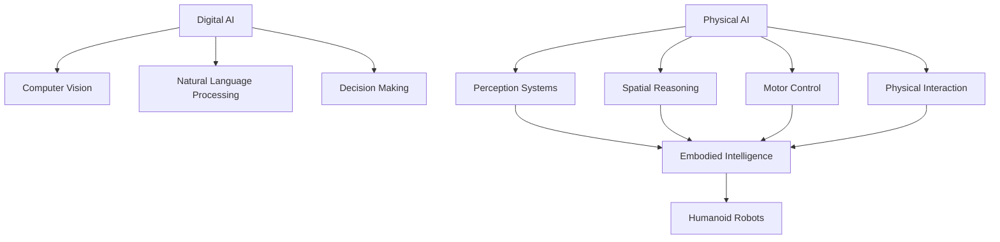
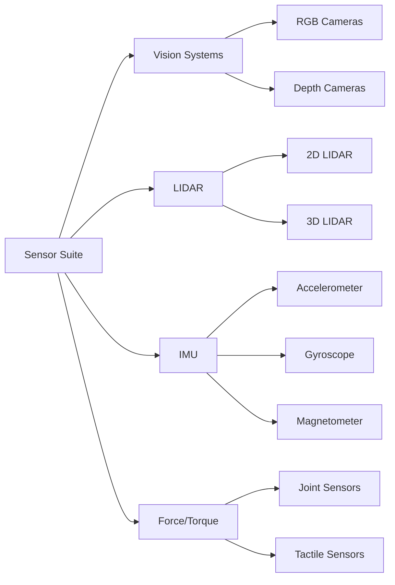

# Chapter 1: Foundations of Physical AI

---

## Introduction

For decades, artificial intelligence lived exclusively in the digital realm—analyzing data, generating text, recognizing images, but never touching the physical world. **Physical AI** changes everything. It represents the convergence of AI with robotics, enabling intelligent systems to perceive, reason about, and act upon the physical environment.

This chapter lays the foundation for understanding how AI transitions from bytes to atoms, from pixels to pistons.

---

## What is Physical AI?

**Physical AI** refers to AI systems that:

* Exist in and interact with the physical world
* Understand physical laws (gravity, friction, momentum, inertia)
* Process real-time sensor data from the environment
* Execute actions through actuators and motors
* Learn from physical interactions and failures

### Digital AI vs Physical AI

| Aspect | Digital AI | Physical AI |
|--------|-----------|-------------|
| **Environment** | Virtual (cloud, servers) | Physical world |
| **Input** | Structured data, text, images | Sensors, cameras, IMUs, LIDAR |
| **Output** | Predictions, text, classifications | Motor commands, physical actions |
| **Latency** | Seconds acceptable | Milliseconds critical |
| **Errors** | Retry possible | Can cause physical damage |
| **Training** | Large datasets, offline | Sim-to-real, online learning |

---

## Embodied Intelligence

**Embodied intelligence** is the philosophy that intelligence emerges from physical interaction with the world. Unlike pure computational models, embodied agents must:

* Handle uncertainty and noise from real sensors
* Deal with actuator limits and mechanical constraints
* Reason about spatial relationships and physics
* Learn through physical trial and error

### Why Humanoid Form Factor?

Humanoid robots aren't just science fiction aesthetics. They offer practical advantages:

* **Human-centered environments**: Our world is designed for bipedal beings
* **Tool compatibility**: Can use existing tools and equipment
* **Social acceptance**: Natural interaction with humans
* **Training data**: Vast amounts of human motion and manipulation data
* **Intuitive teleoperation**: Human operators understand the robot's movements

---

## From Digital to Physical: The Transformation

### The Challenge of Reality

Deploying AI in physical systems introduces challenges absent in digital domains:

* **Real-time constraints**: Robots can't wait for cloud inference
* **Safety requirements**: Wrong predictions can cause injury
* **Hardware limitations**: Limited compute on edge devices
* **Wear and tear**: Physical components degrade over time
* **Environmental variability**: Lighting, weather, terrain changes

### The Sim-to-Real Gap

Training robots entirely in the physical world is:

* **Expensive**: Hardware wear and damage
* **Slow**: Real-time interactions limit training speed
* **Dangerous**: Failures can harm people or equipment

Solution: Train in simulation, transfer to reality.

**Sim-to-Real Transfer** involves:

1. Training models in photorealistic simulators
2. Domain randomization to improve generalization
3. Fine-tuning with limited real-world data
4. Continuous learning and adaptation

---

## The Humanoid Robotics Landscape

### Current State of Humanoid Robotics

The humanoid robotics industry is experiencing rapid growth:

**Leading Platforms**:

* **Tesla Optimus**: General-purpose humanoid for manufacturing
* **Boston Dynamics Atlas**: Research platform with advanced mobility
* **Unitree G1**: Affordable ($16k) humanoid with open SDK
* **Figure 01**: Autonomous warehouse humanoid
* **1X NEO**: Home assistant humanoid

### Key Capabilities

Modern humanoid robots demonstrate:

* **Bipedal locomotion**: Walking, running, climbing stairs
* **Dexterous manipulation**: Object grasping and tool use
* **Visual perception**: SLAM, object recognition, scene understanding
* **Natural interaction**: Voice commands, gesture recognition

---

## Sensor Systems for Physical AI

Physical AI depends on rich sensory input. Humanoid robots typically integrate multiple sensor modalities:

### Vision Systems

**RGB Cameras**
* Standard color cameras for object recognition
* Multiple cameras for stereo vision and depth estimation
* High-frame-rate cameras for fast motion tracking

**Depth Cameras**
* Intel RealSense: Active stereo depth sensing
* Time-of-Flight (ToF): Direct distance measurement
* Structured light: Pattern projection for 3D scanning

### LIDAR (Light Detection and Ranging)

* Laser-based distance measurement
* 360-degree environmental scanning
* Robust to lighting conditions
* Used for navigation and obstacle avoidance

**Common LIDAR Types**:
* **2D LIDAR**: Scans single plane (e.g., SICK TiM series)
* **3D LIDAR**: Multi-plane scanning (e.g., Velodyne, Ouster)

### Inertial Measurement Units (IMUs)

IMUs provide crucial information about robot orientation and acceleration:

* **Accelerometer**: Linear acceleration (3-axis)
* **Gyroscope**: Angular velocity (3-axis)
* **Magnetometer**: Magnetic field orientation (3-axis)

**Applications**:
* Balance control for bipedal walking
* Orientation estimation
* Fall detection
* Motion prediction

### Force/Torque Sensors

Critical for manipulation and interaction:

* **Joint torque sensors**: Measure forces at each joint
* **Fingertip sensors**: Detect contact and grip force
* **Foot pressure sensors**: Balance and terrain adaptation

---

## Sensor Fusion

No single sensor provides complete information. **Sensor fusion** combines data from multiple sensors to create a more accurate and robust understanding of the environment.

### Complementary Strengths

* **Cameras**: High resolution, color, texture
* **LIDAR**: Accurate distance, works in darkness
* **IMU**: High-frequency orientation updates
* **Force sensors**: Physical contact information

### Fusion Techniques

* **Kalman Filters**: Optimal estimation for linear systems
* **Extended Kalman Filters (EKF)**: Non-linear system estimation
* **Particle Filters**: Multi-modal probability distributions
* **Deep learning fusion**: Neural networks for multi-modal integration

---

## Physical AI Applications

### Industrial Automation

* Warehouse picking and packing
* Assembly line tasks
* Quality inspection
* Material handling

### Healthcare

* Surgical assistance
* Patient mobility support
* Medication delivery
* Sanitization and cleaning

### Domestic Services

* Household chores
* Elderly care
* Security and monitoring
* Entertainment and companionship

### Exploration

* Search and rescue
* Space exploration
* Hazardous environment inspection
* Agricultural automation

---

## The Future of Physical AI

### Emerging Trends

* **Foundation models for robotics**: Pre-trained models like RT-2, PaLM-E
* **Vision-Language-Action (VLA)**: Natural language control of robots
* **Teleoperation to autonomy**: Learning from human demonstrations
* **Swarm robotics**: Coordinated multi-robot systems

### Challenges Ahead

* **Energy efficiency**: Battery life limits operational time
* **Robustness**: Handling unexpected situations gracefully
* **Affordability**: Reducing costs for widespread adoption
* **Ethics and safety**: Ensuring responsible deployment

---

## Key Takeaways

* Physical AI bridges the gap between digital intelligence and physical action
* Embodied intelligence requires understanding physics and real-world constraints
* Humanoid form factor offers unique advantages for human environments
* Multi-modal sensor fusion is essential for robust perception
* Sim-to-real transfer enables efficient training while minimizing risk

---

## Practical Exercise

**Exercise 1.1: Sensor Analysis**

Research and compare three different depth cameras available for robotics applications. Create a table comparing:

* Cost
* Range
* Field of view
* Frame rate
* Indoor/outdoor performance
* ROS 2 support

**Exercise 1.2: Sim-to-Real Research**

Find and summarize one academic paper on sim-to-real transfer for robotic manipulation. Focus on:

* What simulation environment was used?
* What techniques were used to bridge the reality gap?
* What was the success rate in real-world deployment?

---

## Further Reading

* Siciliano, B., & Khatib, O. (2016). *Springer Handbook of Robotics*
* Thrun, S., Burgard, W., & Fox, D. (2005). *Probabilistic Robotics*
* IEEE Transactions on Robotics (journal)
* arXiv.org robotics section

---

**Next**: [Chapter 2 - ROS 2 Fundamentals →](/docs/module1/module1-chapter2)