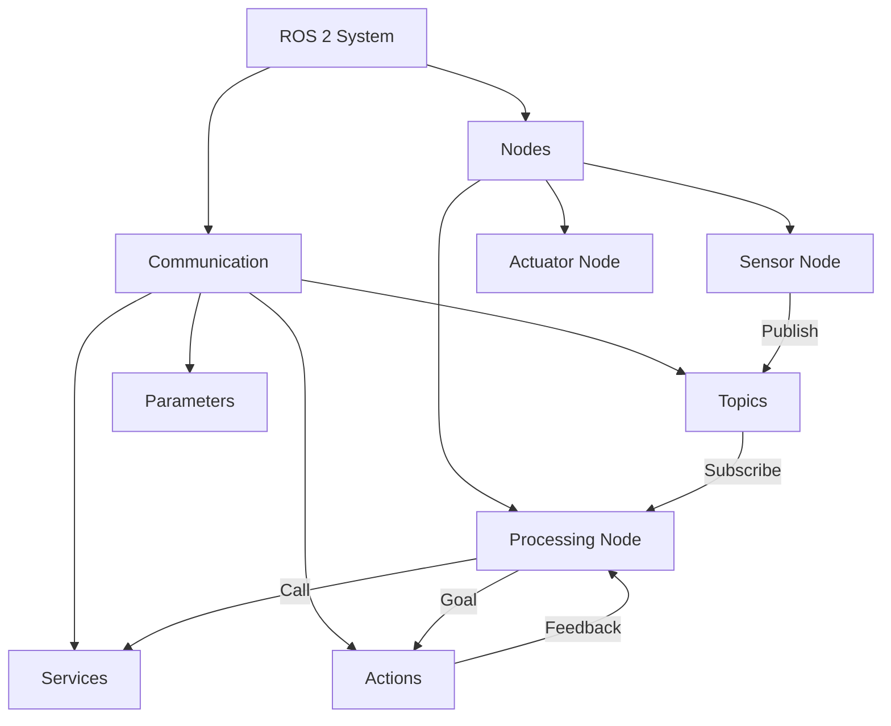

# Chapter 2: ROS 2 Fundamentals

---

## Introduction

The **Robot Operating System 2 (ROS 2)** is the middleware that powers modern robotics. Think of it as the nervous system that enables different parts of a robot—sensors, actuators, decision-making algorithms—to communicate seamlessly.

In this chapter, you'll learn the core concepts of ROS 2 and build your first robotic applications.

---

## ROS 2 Architecture

### Core Components

ROS 2 is built on several key abstractions:

* **Nodes**: Independent processes that perform computation
* **Topics**: Named channels for asynchronous data streaming
* **Services**: Synchronous request-response communication
* **Actions**: Long-running tasks with feedback
* **Parameters**: Configuration values for nodes



### DDS: The Foundation

ROS 2 uses **Data Distribution Service (DDS)** as its middleware layer. DDS provides:

* Discovery: Nodes automatically find each other
* Serialization: Efficient data encoding
* Quality of Service: Reliability and latency controls
* Security: Authentication and encryption

---

## Setting Up ROS 2

### Installation on Ubuntu 22.04

**Step 1: Set up sources**

```bash
sudo apt update && sudo apt install -y software-properties-common
sudo add-apt-repository universe
```

**Step 2: Add ROS 2 apt repository**

```bash
sudo apt update && sudo apt install curl -y
sudo curl -sSL https://raw.githubusercontent.com/ros/rosdistro/master/ros.key -o /usr/share/keyrings/ros-archive-keyring.gpg

echo "deb [arch=$(dpkg --print-architecture) signed-by=/usr/share/keyrings/ros-archive-keyring.gpg] http://packages.ros.org/ros2/ubuntu $(. /etc/os-release && echo $UBUNTU_CODENAME) main" | sudo tee /etc/apt/sources.list.d/ros2.list > /dev/null
```

**Step 3: Install ROS 2 Humble**

```bash
sudo apt update
sudo apt upgrade
sudo apt install ros-humble-desktop
```

**Step 4: Environment setup**

```bash
echo "source /opt/ros/humble/setup.bash" >> ~/.bashrc
source ~/.bashrc
```

**Step 5: Install colcon build tools**

```bash
sudo apt install python3-colcon-common-extensions
```

**Verify installation**:

```bash
ros2 --version
# Should output: ros2 doctor 0.10.5
```

---

## Understanding Nodes

**Nodes** are the fundamental building blocks of ROS 2. Each node is an independent process responsible for a specific task.

### Node Characteristics

* **Modularity**: Each node handles one responsibility
* **Independence**: Nodes can crash without affecting others
* **Reusability**: Nodes can be used across different projects
* **Distribution**: Nodes can run on different machines

### Creating Your First Node

**Example: Simple Publisher Node**

```python
import rclpy
from rclpy.node import Node
from std_msgs.msg import String

class MinimalPublisher(Node):
    def __init__(self):
        super().__init__('minimal_publisher')
        self.publisher_ = self.create_publisher(String, 'topic', 10)
        timer_period = 0.5  # seconds
        self.timer = self.create_timer(timer_period, self.timer_callback)
        self.i = 0

    def timer_callback(self):
        msg = String()
        msg.data = f'Hello World: {self.i}'
        self.publisher_.publish(msg)
        self.get_logger().info(f'Publishing: "{msg.data}"')
        self.i += 1

def main(args=None):
    rclpy.init(args=args)
    node = MinimalPublisher()
    rclpy.spin(node)
    node.destroy_node()
    rclpy.shutdown()

if __name__ == '__main__':
    main()
```

**Key Elements**:

* `Node` class: Base class for all ROS 2 nodes
* `create_publisher()`: Creates a publisher object
* `create_timer()`: Schedules periodic callbacks
* `get_logger()`: Built-in logging system
* `rclpy.spin()`: Keeps the node alive

---

## Topics: Publish-Subscribe Pattern

Topics enable **asynchronous many-to-many communication**. Multiple publishers can send data to a topic, and multiple subscribers can receive it.

### When to Use Topics

* Streaming sensor data (camera, LIDAR)
* Continuous state updates
* High-frequency data (IMU readings)
* Broadcasting information to multiple consumers

### Message Types

ROS 2 uses **message types** to define data structures. Common message types:

* `std_msgs/String`: Text messages
* `std_msgs/Int32`: Integer values
* `geometry_msgs/Twist`: Velocity commands
* `sensor_msgs/Image`: Camera images
* `sensor_msgs/LaserScan`: LIDAR data

### Creating a Subscriber

```python
import rclpy
from rclpy.node import Node
from std_msgs.msg import String

class MinimalSubscriber(Node):
    def __init__(self):
        super().__init__('minimal_subscriber')
        self.subscription = self.create_subscription(
            String,
            'topic',
            self.listener_callback,
            10)

    def listener_callback(self, msg):
        self.get_logger().info(f'I heard: "{msg.data}"')

def main(args=None):
    rclpy.init(args=args)
    node = MinimalSubscriber()
    rclpy.spin(node)
    node.destroy_node()
    rclpy.shutdown()

if __name__ == '__main__':
    main()
```

### Testing Publishers and Subscribers

**Terminal 1 - Run publisher**:
```bash
python3 minimal_publisher.py
```

**Terminal 2 - Run subscriber**:
```bash
python3 minimal_subscriber.py
```

**Terminal 3 - Monitor topics**:
```bash
ros2 topic list
ros2 topic echo /topic
ros2 topic hz /topic
```

---

## Services: Request-Response Pattern

Services provide **synchronous request-response communication**. A client sends a request and waits for the server to respond.

### When to Use Services

* One-time requests (capture image, compute path)
* Configuration changes
* State queries
* Actions that need confirmation

### Creating a Service Server

```python
import rclpy
from rclpy.node import Node
from example_interfaces.srv import AddTwoInts

class MinimalService(Node):
    def __init__(self):
        super().__init__('minimal_service')
        self.srv = self.create_service(
            AddTwoInts,
            'add_two_ints',
            self.add_two_ints_callback)

    def add_two_ints_callback(self, request, response):
        response.sum = request.a + request.b
        self.get_logger().info(f'Incoming request: {request.a} + {request.b}')
        return response

def main(args=None):
    rclpy.init(args=args)
    node = MinimalService()
    rclpy.spin(node)
    rclpy.shutdown()

if __name__ == '__main__':
    main()
```

### Creating a Service Client

```python
import rclpy
from rclpy.node import Node
from example_interfaces.srv import AddTwoInts

class MinimalClientAsync(Node):
    def __init__(self):
        super().__init__('minimal_client_async')
        self.cli = self.create_client(AddTwoInts, 'add_two_ints')
        while not self.cli.wait_for_service(timeout_sec=1.0):
            self.get_logger().info('service not available, waiting...')
        self.req = AddTwoInts.Request()

    def send_request(self, a, b):
        self.req.a = a
        self.req.b = b
        self.future = self.cli.call_async(self.req)
        rclpy.spin_until_future_complete(self, self.future)
        return self.future.result()

def main(args=None):
    rclpy.init(args=args)
    node = MinimalClientAsync()
    response = node.send_request(5, 7)
    node.get_logger().info(f'Result: {response.sum}')
    node.destroy_node()
    rclpy.shutdown()

if __name__ == '__main__':
    main()
```

---

## Actions: Long-Running Tasks

Actions are for tasks that:

* Take time to complete
* Need progress feedback
* Can be cancelled mid-execution

### Action Structure

An action has three parts:

* **Goal**: What to achieve
* **Feedback**: Progress updates
* **Result**: Final outcome

**Example use cases**:

* Navigate to a waypoint
* Pick up an object
* Execute a trajectory

---

## Building ROS 2 Packages

### Package Structure

A ROS 2 Python package has this structure:

```
my_robot_package/
├── package.xml          # Package metadata
├── setup.py            # Python package setup
├── setup.cfg           # Configuration
├── resource/           # Package marker
└── my_robot_package/   # Python code
    ├── __init__.py
    ├── my_node.py
    └── my_other_node.py
```

### Creating a Package

```bash
cd ~/ros2_ws/src
ros2 pkg create --build-type ament_python my_robot_package --dependencies rclpy std_msgs
```

### package.xml

```xml
<?xml version="1.0"?>
<?xml-model href="http://download.ros.org/schema/package_format3.xsd" schematypens="http://www.w3.org/2001/XMLSchema"?>
<package format="3">
  <name>my_robot_package</name>
  <version>0.0.1</version>
  <description>My robot control package</description>
  <maintainer email="you@example.com">Your Name</maintainer>
  <license>Apache-2.0</license>

  <depend>rclpy</depend>
  <depend>std_msgs</depend>

  <test_depend>ament_copyright</test_depend>
  <test_depend>ament_flake8</test_depend>
  <test_depend>ament_pep257</test_depend>
  <test_depend>python3-pytest</test_depend>

  <export>
    <build_type>ament_python</build_type>
  </export>
</package>
```

### Building Packages

```bash
cd ~/ros2_ws
colcon build --packages-select my_robot_package
source install/setup.bash
```

---

## Launch Files

Launch files start multiple nodes with a single command.

### Python Launch File

```python
from launch import LaunchDescription
from launch_ros.actions import Node

def generate_launch_description():
    return LaunchDescription([
        Node(
            package='my_robot_package',
            executable='publisher',
            name='talker',
            output='screen'
        ),
        Node(
            package='my_robot_package',
            executable='subscriber',
            name='listener',
            output='screen'
        )
    ])
```

**Run launch file**:

```bash
ros2 launch my_robot_package my_launch_file.launch.py
```

---

## Parameters

Parameters allow runtime configuration without modifying code.

### Declaring Parameters

```python
class MyNode(Node):
    def __init__(self):
        super().__init__('my_node')
        self.declare_parameter('my_param', 'default_value')
        my_param = self.get_parameter('my_param').value
        self.get_logger().info(f'Parameter value: {my_param}')
```

### Setting Parameters

**Command line**:
```bash
ros2 run my_package my_node --ros-args -p my_param:=new_value
```

**YAML file**:
```yaml
my_node:
  ros__parameters:
    my_param: new_value
    another_param: 42
```

---

## ROS 2 Command Line Tools

### Essential Commands

**List nodes**:
```bash
ros2 node list
ros2 node info /node_name
```

**Work with topics**:
```bash
ros2 topic list
ros2 topic echo /topic_name
ros2 topic hz /topic_name
ros2 topic info /topic_name
```

**Work with services**:
```bash
ros2 service list
ros2 service call /service_name service_type "{request_data}"
```

**Work with parameters**:
```bash
ros2 param list
ros2 param get /node_name param_name
ros2 param set /node_name param_name value
```

---

## Practical Projects

### Project 2.1: Temperature Monitor

Create a system with:

* **Publisher node**: Simulates temperature sensor readings
* **Subscriber node**: Monitors temperatures and logs warnings
* Use `std_msgs/Float32` for temperature values

### Project 2.2: Robot Controller

Build a service-based robot controller:

* **Server**: Accepts movement commands (forward, backward, turn)
* **Client**: Sends commands and receives confirmation
* Create custom service type for robot commands

### Project 2.3: Multi-Node System

Create a complete robotic system:

* Sensor simulation node (publishes fake sensor data)
* Processing node (subscribes to sensor, publishes processed data)
* Actuator node (subscribes to commands, logs actions)
* Use launch file to start all nodes

---

## Key Takeaways

* ROS 2 uses nodes as independent computational units
* Topics enable asynchronous publish-subscribe communication
* Services provide synchronous request-response patterns
* Actions handle long-running tasks with feedback
* Packages organize code and dependencies
* Launch files orchestrate multi-node systems
* Parameters enable runtime configuration

---

## Further Resources

* Official ROS 2 Documentation: https://docs.ros.org
* ROS 2 Tutorials: https://docs.ros.org/en/humble/Tutorials.html
* ROS Discourse Forum: https://discourse.ros.org
* GitHub ROS 2 Examples: https://github.com/ros2/examples

---

**Next**: [Chapter 3 - Advanced ROS 2 Concepts →](/docs/module1/module1-chapter3)