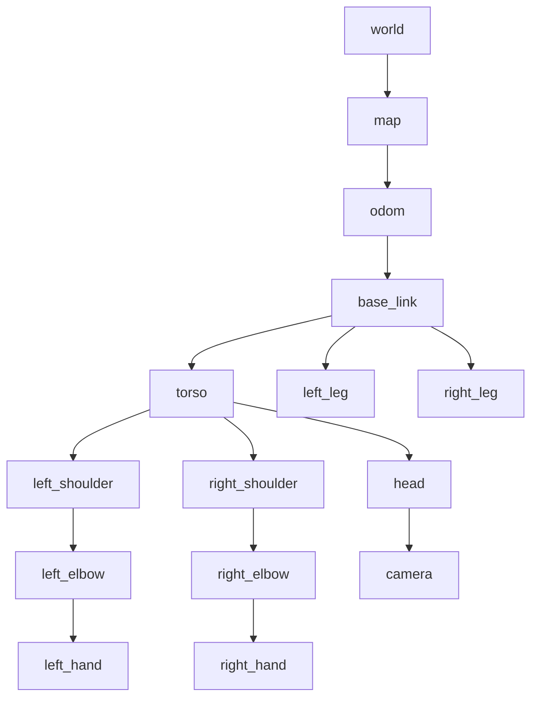

# Chapter 3: Advanced ROS 2 Concepts

---

## Introduction

Now that you understand ROS 2 fundamentals, it's time to dive into advanced concepts that enable sophisticated robotic systems. This chapter covers robot description formats, coordinate transformations, quality of service policies, and custom message types.

---

## URDF: Unified Robot Description Format

**URDF** is an XML format for describing robot kinematics and dynamics. It defines:

* Links (rigid body parts)
* Joints (connections between links)
* Sensors and actuators
* Visual and collision geometry
* Physical properties (mass, inertia)

### Basic URDF Structure

```xml
<?xml version="1.0"?>
<robot name="simple_robot">
  <!-- Base link -->
  <link name="base_link">
    <visual>
      <geometry>
        <box size="0.6 0.4 0.2"/>
      </geometry>
      <material name="blue">
        <color rgba="0 0 0.8 1"/>
      </material>
    </visual>
    <collision>
      <geometry>
        <box size="0.6 0.4 0.2"/>
      </geometry>
    </collision>
    <inertial>
      <mass value="10"/>
      <inertia ixx="0.4" ixy="0.0" ixz="0.0"
               iyy="0.6" iyz="0.0" izz="0.8"/>
    </inertial>
  </link>

  <!-- Wheel link -->
  <link name="left_wheel">
    <visual>
      <geometry>
        <cylinder radius="0.1" length="0.05"/>
      </geometry>
      <material name="black">
        <color rgba="0 0 0 1"/>
      </material>
    </visual>
  </link>

  <!-- Joint connecting base to wheel -->
  <joint name="left_wheel_joint" type="continuous">
    <parent link="base_link"/>
    <child link="left_wheel"/>
    <origin xyz="-0.2 0.25 0" rpy="0 0 0"/>
    <axis xyz="0 1 0"/>
  </joint>
</robot>
```

### Joint Types

* **fixed**: No movement (e.g., camera mount)
* **revolute**: Rotation with limits (e.g., robot arm)
* **continuous**: Unlimited rotation (e.g., wheels)
* **prismatic**: Linear sliding (e.g., elevator)
* **floating**: 6-DOF movement (rarely used)
* **planar**: Movement in a plane

### Humanoid Robot URDF Example

```xml
<robot name="humanoid">
  <!-- Torso -->
  <link name="torso">
    <visual>
      <geometry>
        <box size="0.3 0.2 0.5"/>
      </geometry>
    </visual>
  </link>

  <!-- Head -->
  <link name="head">
    <visual>
      <geometry>
        <sphere radius="0.12"/>
      </geometry>
    </visual>
  </link>

  <joint name="neck_joint" type="revolute">
    <parent link="torso"/>
    <child link="head"/>
    <origin xyz="0 0 0.35" rpy="0 0 0"/>
    <axis xyz="0 0 1"/>
    <limit lower="-0.785" upper="0.785" effort="10" velocity="1.0"/>
  </joint>

  <!-- Right Arm -->
  <link name="right_upper_arm">
    <visual>
      <geometry>
        <cylinder radius="0.04" length="0.3"/>
      </geometry>
    </visual>
  </link>

  <joint name="right_shoulder_joint" type="revolute">
    <parent link="torso"/>
    <child link="right_upper_arm"/>
    <origin xyz="0 -0.15 0.2" rpy="0 0 0"/>
    <axis xyz="1 0 0"/>
    <limit lower="-3.14" upper="3.14" effort="30" velocity="2.0"/>
  </joint>
</robot>
```

### Visualizing URDF in RViz2

```bash
# Install urdf_tutorial package
sudo apt install ros-humble-urdf-tutorial

# Launch RViz with robot model
ros2 launch urdf_tutorial display.launch.py model:=path/to/robot.urdf
```

### Xacro: Macro Language for URDF

**Xacro** extends URDF with:

* Variables and constants
* Mathematical expressions
* Macros for reusable components
* Conditional statements

**Example**:

```xml
<?xml version="1.0"?>
<robot xmlns:xacro="http://www.ros.org/wiki/xacro" name="robot">
  <!-- Define properties -->
  <xacro:property name="wheel_radius" value="0.1"/>
  <xacro:property name="wheel_width" value="0.05"/>

  <!-- Macro for creating wheels -->
  <xacro:macro name="wheel" params="prefix reflect">
    <link name="${prefix}_wheel">
      <visual>
        <geometry>
          <cylinder radius="${wheel_radius}" length="${wheel_width}"/>
        </geometry>
      </visual>
    </link>

    <joint name="${prefix}_wheel_joint" type="continuous">
      <parent link="base_link"/>
      <child link="${prefix}_wheel"/>
      <origin xyz="0 ${reflect*0.3} 0" rpy="0 0 0"/>
      <axis xyz="0 1 0"/>
    </joint>
  </xacro:macro>

  <!-- Use the macro -->
  <xacro:wheel prefix="left" reflect="1"/>
  <xacro:wheel prefix="right" reflect="-1"/>
</robot>
```

**Convert Xacro to URDF**:

```bash
xacro robot.urdf.xacro > robot.urdf
```

---

## TF2: Transform System

**TF2** manages coordinate frames and transformations in ROS 2. It answers questions like:

* Where is the camera relative to the robot base?
* What is the robot's position in the world?
* Where is the target object relative to the gripper?



### Key TF2 Concepts

* **Frame**: A coordinate system
* **Transform**: Relationship between two frames (translation + rotation)
* **TF Tree**: Hierarchical structure of frames
* **Static Transform**: Never changes (camera to base_link)
* **Dynamic Transform**: Updates continuously (wheels, joints)

### Broadcasting Static Transforms

```python
import rclpy
from rclpy.node import Node
from geometry_msgs.msg import TransformStamped
from tf2_ros import StaticTransformBroadcaster

class StaticFramePublisher(Node):
    def __init__(self):
        super().__init__('static_tf_publisher')
        
        self.tf_broadcaster = StaticTransformBroadcaster(self)
        
        # Create static transform
        static_transform = TransformStamped()
        static_transform.header.stamp = self.get_clock().now().to_msg()
        static_transform.header.frame_id = 'base_link'
        static_transform.child_frame_id = 'camera_link'
        
        # Set translation
        static_transform.transform.translation.x = 0.0
        static_transform.transform.translation.y = 0.0
        static_transform.transform.translation.z = 0.5
        
        # Set rotation (quaternion)
        static_transform.transform.rotation.x = 0.0
        static_transform.transform.rotation.y = 0.0
        static_transform.transform.rotation.z = 0.0
        static_transform.transform.rotation.w = 1.0
        
        self.tf_broadcaster.sendTransform(static_transform)

def main():
    rclpy.init()
    node = StaticFramePublisher()
    rclpy.spin(node)
    rclpy.shutdown()
```

### Broadcasting Dynamic Transforms

```python
import rclpy
from rclpy.node import Node
from geometry_msgs.msg import TransformStamped
from tf2_ros import TransformBroadcaster
import math

class DynamicFramePublisher(Node):
    def __init__(self):
        super().__init__('dynamic_tf_publisher')
        
        self.tf_broadcaster = TransformBroadcaster(self)
        self.timer = self.create_timer(0.1, self.broadcast_timer_callback)
        self.angle = 0.0

    def broadcast_timer_callback(self):
        t = TransformStamped()
        t.header.stamp = self.get_clock().now().to_msg()
        t.header.frame_id = 'base_link'
        t.child_frame_id = 'rotating_frame'
        
        # Circular motion
        t.transform.translation.x = math.cos(self.angle)
        t.transform.translation.y = math.sin(self.angle)
        t.transform.translation.z = 0.0
        
        t.transform.rotation.x = 0.0
        t.transform.rotation.y = 0.0
        t.transform.rotation.z = math.sin(self.angle / 2)
        t.transform.rotation.w = math.cos(self.angle / 2)
        
        self.tf_broadcaster.sendTransform(t)
        self.angle += 0.05

def main():
    rclpy.init()
    node = DynamicFramePublisher()
    rclpy.spin(node)
    rclpy.shutdown()
```

### Listening to Transforms

```python
import rclpy
from rclpy.node import Node
from tf2_ros import TransformException
from tf2_ros.buffer import Buffer
from tf2_ros.transform_listener import TransformListener

class FrameListener(Node):
    def __init__(self):
        super().__init__('frame_listener')
        
        self.tf_buffer = Buffer()
        self.tf_listener = TransformListener(self.tf_buffer, self)
        
        self.timer = self.create_timer(1.0, self.on_timer)

    def on_timer(self):
        try:
            # Look up transform from base_link to camera_link
            transform = self.tf_buffer.lookup_transform(
                'base_link',
                'camera_link',
                rclpy.time.Time())
            
            self.get_logger().info(
                f'Translation: x={transform.transform.translation.x:.2f}, '
                f'y={transform.transform.translation.y:.2f}, '
                f'z={transform.transform.translation.z:.2f}')
                
        except TransformException as ex:
            self.get_logger().warn(f'Could not transform: {ex}')

def main():
    rclpy.init()
    node = FrameListener()
    rclpy.spin(node)
    rclpy.shutdown()
```

### Visualizing TF Tree

```bash
# View TF tree in RViz2
ros2 run rviz2 rviz2

# Generate TF tree diagram
ros2 run tf2_tools view_frames
```

---

## Quality of Service (QoS)

**QoS policies** control how messages are delivered between publishers and subscribers. They balance reliability, latency, and resource usage.

### Key QoS Parameters

**Reliability**:
* `RELIABLE`: Guarantees delivery (TCP-like)
* `BEST_EFFORT`: No guarantees (UDP-like)

**Durability**:
* `TRANSIENT_LOCAL`: Stores messages for late-joining subscribers
* `VOLATILE`: No message storage

**History**:
* `KEEP_LAST(n)`: Keep only last n messages
* `KEEP_ALL`: Keep all messages

**Lifespan**:
* Duration messages remain valid

**Deadline**:
* Expected maximum time between messages

### QoS Profiles

```python
from rclpy.qos import QoSProfile, ReliabilityPolicy, DurabilityPolicy, HistoryPolicy

# Sensor data profile (best effort, fast)
sensor_qos = QoSProfile(
    reliability=ReliabilityPolicy.BEST_EFFORT,
    durability=DurabilityPolicy.VOLATILE,
    history=HistoryPolicy.KEEP_LAST,
    depth=10
)

# Services profile (reliable)
services_qos = QoSProfile(
    reliability=ReliabilityPolicy.RELIABLE,
    durability=DurabilityPolicy.VOLATILE,
    history=HistoryPolicy.KEEP_LAST,
    depth=10
)

# Parameter events (transient local)
parameter_qos = QoSProfile(
    reliability=ReliabilityPolicy.RELIABLE,
    durability=DurabilityPolicy.TRANSIENT_LOCAL,
    history=HistoryPolicy.KEEP_LAST,
    depth=1000
)
```

### Using QoS in Publishers/Subscribers

```python
class SensorPublisher(Node):
    def __init__(self):
        super().__init__('sensor_publisher')
        
        # Create QoS profile for sensor data
        qos = QoSProfile(
            reliability=ReliabilityPolicy.BEST_EFFORT,
            history=HistoryPolicy.KEEP_LAST,
            depth=10
        )
        
        self.publisher = self.create_publisher(
            LaserScan,
            'scan',
            qos)  # Apply QoS profile
```

### QoS Best Practices

* **Sensor data**: Use `BEST_EFFORT` for high-frequency streams
* **Commands**: Use `RELIABLE` for critical control messages
* **Configuration**: Use `TRANSIENT_LOCAL` for late-joining nodes
* **Diagnostics**: Use `RELIABLE` with `KEEP_LAST(1)`

---

## Custom Message Types

### Creating Custom Messages

**Step 1: Create package**

```bash
ros2 pkg create --build-type ament_cmake my_custom_msgs
cd my_custom_msgs
mkdir msg
```

**Step 2: Define message**

`msg/RobotStatus.msg`:

```
string robot_name
float32 battery_level
float32 temperature
bool is_moving
geometry_msgs/Pose current_pose
```

**Step 3: Update package.xml**

```xml
<depend>geometry_msgs</depend>
<build_depend>rosidl_default_generators</build_depend>
<exec_depend>rosidl_default_runtime</exec_depend>
<member_of_group>rosidl_interface_packages</member_of_group>
```

**Step 4: Update CMakeLists.txt**

```cmake
find_package(rosidl_default_generators REQUIRED)
find_package(geometry_msgs REQUIRED)

rosidl_generate_interfaces(${PROJECT_NAME}
  "msg/RobotStatus.msg"
  DEPENDENCIES geometry_msgs
)
```

**Step 5: Build**

```bash
colcon build --packages-select my_custom_msgs
source install/setup.bash
```

### Using Custom Messages

```python
from my_custom_msgs.msg import RobotStatus

class StatusPublisher(Node):
    def __init__(self):
        super().__init__('status_publisher')
        self.publisher = self.create_publisher(RobotStatus, 'robot_status', 10)
        self.timer = self.create_timer(1.0, self.publish_status)

    def publish_status(self):
        msg = RobotStatus()
        msg.robot_name = 'Humanoid_01'
        msg.battery_level = 85.5
        msg.temperature = 42.3
        msg.is_moving = True
        
        # Set pose
        msg.current_pose.position.x = 1.0
        msg.current_pose.position.y = 2.0
        msg.current_pose.position.z = 0.0
        
        self.publisher.publish(msg)
        self.get_logger().info('Publishing robot status')
```

### Creating Custom Services

`srv/MoveRobot.srv`:

```
# Request
float32 distance
float32 speed
---
# Response
bool success
string message
float32 time_taken
```

---

## Advanced Launch Files

### Parameterized Launch Files

```python
from launch import LaunchDescription
from launch.actions import DeclareLaunchArgument
from launch.substitutions import LaunchConfiguration
from launch_ros.actions import Node

def generate_launch_description():
    # Declare arguments
    robot_name_arg = DeclareLaunchArgument(
        'robot_name',
        default_value='humanoid_01',
        description='Name of the robot'
    )
    
    use_sim_time_arg = DeclareLaunchArgument(
        'use_sim_time',
        default_value='false',
        description='Use simulation time'
    )
    
    # Use arguments
    robot_name = LaunchConfiguration('robot_name')
    use_sim_time = LaunchConfiguration('use_sim_time')
    
    # Define nodes
    controller_node = Node(
        package='my_robot_controller',
        executable='controller',
        name=robot_name,
        parameters=[{
            'use_sim_time': use_sim_time,
            'robot_name': robot_name
        }],
        output='screen'
    )
    
    return LaunchDescription([
        robot_name_arg,
        use_sim_time_arg,
        controller_node
    ])
```

**Run with arguments**:

```bash
ros2 launch my_package robot.launch.py robot_name:=humanoid_02 use_sim_time:=true
```

### Conditional Launch

```python
from launch.conditions import IfCondition
from launch.substitutions import LaunchConfiguration

def generate_launch_description():
    enable_camera = LaunchConfiguration('enable_camera')
    
    camera_node = Node(
        package='camera_driver',
        executable='camera_node',
        condition=IfCondition(enable_camera),
        output='screen'
    )
    
    return LaunchDescription([
        DeclareLaunchArgument('enable_camera', default_value='true'),
        camera_node
    ])
```

---

## Lifecycle Nodes

**Lifecycle nodes** provide managed states for critical components:

* `unconfigured`: Initial state
* `inactive`: Configured but not active
* `active`: Running normally
* `finalized`: Shut down

### Creating a Lifecycle Node

```python
from rclpy.lifecycle import Node as LifecycleNode, State, TransitionCallbackReturn

class ManagedNode(LifecycleNode):
    def on_configure(self, state: State) -> TransitionCallbackReturn:
        self.get_logger().info('Configuring...')
        # Initialize resources
        return TransitionCallbackReturn.SUCCESS

    def on_activate(self, state: State) -> TransitionCallbackReturn:
        self.get_logger().info('Activating...')
        # Start operation
        return TransitionCallbackReturn.SUCCESS

    def on_deactivate(self, state: State) -> TransitionCallbackReturn:
        self.get_logger().info('Deactivating...')
        # Stop operation
        return TransitionCallbackReturn.SUCCESS

    def on_cleanup(self, state: State) -> TransitionCallbackReturn:
        self.get_logger().info('Cleaning up...')
        # Release resources
        return TransitionCallbackReturn.SUCCESS
```

---

## Practical Projects

### Project 3.1: Robot Model Visualization

* Create a URDF model for a simple humanoid robot
* Use Xacro to make the model parameterizable
* Visualize in RViz2 with joint state publisher

### Project 3.2: Multi-Frame Navigation

* Broadcast TF transforms for a mobile robot
* Create a node that listens to transforms
* Compute relative positions between frames

### Project 3.3: Custom Message Pipeline

* Define custom messages for robot telemetry
* Create publisher for sensor data
* Build subscriber for data processing
* Implement QoS policies appropriate for each data type

---

## Key Takeaways

* URDF describes robot structure and properties
* Xacro adds programmability to URDF
* TF2 manages coordinate transformations between frames
* QoS policies control message delivery guarantees
* Custom messages enable domain-specific communication
* Lifecycle nodes provide managed state transitions
* Advanced launch files enable flexible system configuration

---

## Further Resources

* URDF Tutorial: http://wiki.ros.org/urdf/Tutorials
* TF2 Documentation: https://docs.ros.org/en/humble/Tutorials/Intermediate/Tf2/Tf2-Main.html
* QoS Guide: https://docs.ros.org/en/humble/Concepts/About-Quality-of-Service-Settings.html
* ROS 2 Design: https://design.ros2.org/

---

**Next Module**: [Module 2 - The Digital Twin →](/docs/module2/overview)