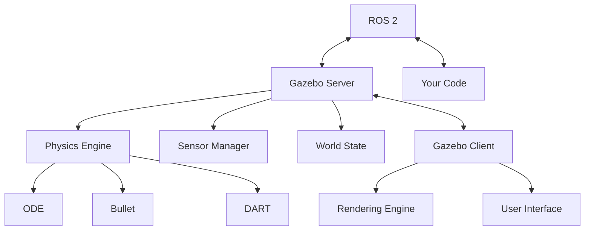

# Chapter 1: Robot Simulation with Gazebo

---

## Introduction

**Gazebo** is the industry-standard open-source robot simulator. Used by NASA, universities, and companies worldwide, Gazebo provides accurate physics simulation, sensor modeling, and seamless ROS 2 integration.

In this chapter, you'll learn to create virtual environments, simulate robots, and test behaviors before deploying to real hardware.

---

## What is Gazebo?

Gazebo is a 3D robot simulator that offers:

* **Accurate physics**: Multiple physics engines (ODE, Bullet, DART, Simbody)
* **Sensor simulation**: Cameras, LIDAR, IMU, GPS, contact sensors
* **Plugin system**: Extend functionality with custom code
* **ROS 2 integration**: Native communication with ROS nodes
* **Visualization**: Real-time 3D rendering

### Gazebo Architecture



---

## Installing Gazebo

### Installation on Ubuntu 22.04

**Option 1: Gazebo Fortress (Stable)**

```bash
sudo apt-get update
sudo apt-get install lsb-release wget gnupg

sudo wget https://packages.osrfoundation.org/gazebo.gpg -O /usr/share/keyrings/pkgs-osrf-archive-keyring.gpg
echo "deb [arch=$(dpkg --print-architecture) signed-by=/usr/share/keyrings/pkgs-osrf-archive-keyring.gpg] http://packages.osrfoundation.org/gazebo/ubuntu-stable $(lsb_release -cs) main" | sudo tee /etc/apt/sources.list.d/gazebo-stable.list > /dev/null

sudo apt-get update
sudo apt-get install gz-fortress
```

**Option 2: Gazebo Harmonic (Latest)**

```bash
sudo apt-get install gz-harmonic
```

**Install ROS 2 Gazebo Bridge**:

```bash
sudo apt install ros-humble-ros-gz
```

**Verify installation**:

```bash
gz sim --version
# Should output: Gazebo Sim, version X.X.X
```

---

## SDF: Simulation Description Format

**SDF (Simulation Description Format)** is an XML format for describing robots and environments in Gazebo. It's more feature-rich than URDF.

### Basic SDF Structure

```xml
<?xml version="1.0" ?>
<sdf version="1.8">
  <world name="simple_world">
    <!-- Physics settings -->
    <physics name="1ms" type="ignored">
      <max_step_size>0.001</max_step_size>
      <real_time_factor>1.0</real_time_factor>
    </physics>

    <!-- Lighting -->
    <light type="directional" name="sun">
      <cast_shadows>true</cast_shadows>
      <pose>0 0 10 0 0 0</pose>
      <diffuse>0.8 0.8 0.8 1</diffuse>
      <specular>0.2 0.2 0.2 1</specular>
    </light>

    <!-- Ground plane -->
    <model name="ground_plane">
      <static>true</static>
      <link name="link">
        <collision name="collision">
          <geometry>
            <plane>
              <normal>0 0 1</normal>
            </plane>
          </geometry>
        </collision>
        <visual name="visual">
          <geometry>
            <plane>
              <normal>0 0 1</normal>
              <size>100 100</size>
            </plane>
          </geometry>
          <material>
            <ambient>0.8 0.8 0.8 1</ambient>
            <diffuse>0.8 0.8 0.8 1</diffuse>
          </material>
        </visual>
      </link>
    </model>
  </world>
</sdf>
```

### Creating a Simple Robot Model

```xml
<?xml version="1.0" ?>
<sdf version="1.8">
  <model name="simple_robot">
    <!-- Base link -->
    <link name="base_link">
      <pose>0 0 0.5 0 0 0</pose>
      
      <inertial>
        <mass>10.0</mass>
        <inertia>
          <ixx>0.1</ixx>
          <ixy>0</ixy>
          <ixz>0</ixz>
          <iyy>0.1</iyy>
          <iyz>0</iyz>
          <izz>0.1</izz>
        </inertia>
      </inertial>
      
      <collision name="collision">
        <geometry>
          <box>
            <size>0.5 0.3 0.2</size>
          </box>
        </geometry>
      </collision>
      
      <visual name="visual">
        <geometry>
          <box>
            <size>0.5 0.3 0.2</size>
          </box>
        </geometry>
        <material>
          <ambient>0.0 0.0 1.0 1</ambient>
          <diffuse>0.0 0.0 1.0 1</diffuse>
        </material>
      </visual>
    </link>

    <!-- Left wheel -->
    <link name="left_wheel">
      <pose>-0.15 0.2 0.5 1.5707 0 0</pose>
      
      <inertial>
        <mass>2.0</mass>
        <inertia>
          <ixx>0.01</ixx>
          <ixy>0</ixy>
          <ixz>0</ixz>
          <iyy>0.01</iyy>
          <iyz>0</iyz>
          <izz>0.01</izz>
        </inertia>
      </inertial>
      
      <collision name="collision">
        <geometry>
          <cylinder>
            <radius>0.1</radius>
            <length>0.05</length>
          </cylinder>
        </geometry>
      </collision>
      
      <visual name="visual">
        <geometry>
          <cylinder>
            <radius>0.1</radius>
            <length>0.05</length>
          </cylinder>
        </geometry>
        <material>
          <ambient>0.2 0.2 0.2 1</ambient>
          <diffuse>0.2 0.2 0.2 1</diffuse>
        </material>
      </visual>
    </link>

    <!-- Joint connecting base to left wheel -->
    <joint name="left_wheel_joint" type="revolute">
      <parent>base_link</parent>
      <child>left_wheel</child>
      <axis>
        <xyz>0 1 0</xyz>
        <limit>
          <lower>-1e16</lower>
          <upper>1e16</upper>
        </limit>
      </axis>
    </joint>

    <!-- Differential drive plugin -->
    <plugin filename="gz-sim-diff-drive-system" name="gz::sim::systems::DiffDrive">
      <left_joint>left_wheel_joint</left_joint>
      <right_joint>right_wheel_joint</right_joint>
      <wheel_separation>0.4</wheel_separation>
      <wheel_radius>0.1</wheel_radius>
    </plugin>
  </model>
</sdf>
```

---

## Launching Gazebo Worlds

### Basic Launch

```bash
gz sim empty.sdf
```

### With Robot Model

```bash
gz sim -r robot_world.sdf
```

### Command Line Options

* `-r`: Start simulation immediately
* `-v 4`: Set verbosity level
* `--gui-config`: Custom GUI configuration
* `--headless`: Run without GUI (for servers)

---

## Physics Engines

Gazebo supports multiple physics engines. Each has trade-offs:

### ODE (Open Dynamics Engine)

* **Pros**: Fast, stable, good for wheeled robots
* **Cons**: Less accurate for complex contacts
* **Use case**: Mobile robots, simple manipulators

### Bullet

* **Pros**: Accurate collision detection, handles complex geometries
* **Cons**: Can be slower than ODE
* **Use case**: Manipulation, grasping

### DART (Dynamic Animation and Robotics Toolkit)

* **Pros**: Excellent for bipedal robots, accurate joint dynamics
* **Cons**: Steeper learning curve
* **Use case**: Humanoids, legged robots

### Configuring Physics

```xml
<physics name="dart_physics" type="dart">
  <max_step_size>0.001</max_step_size>
  <real_time_factor>1.0</real_time_factor>
  <real_time_update_rate>1000.0</real_time_update_rate>
  
  <dart>
    <collision_detector>bullet</collision_detector>
    <solver>
      <solver_type>dantzig</solver_type>
    </solver>
  </dart>
</physics>
```

---

## Sensor Simulation

### Camera Sensor

```xml
<sensor name="camera" type="camera">
  <pose>0.2 0 0.3 0 0 0</pose>
  <camera>
    <horizontal_fov>1.047</horizontal_fov>
    <image>
      <width>640</width>
      <height>480</height>
      <format>R8G8B8</format>
    </image>
    <clip>
      <near>0.1</near>
      <far>100</far>
    </clip>
    <noise>
      <type>gaussian</type>
      <mean>0.0</mean>
      <stddev>0.007</stddev>
    </noise>
  </camera>
  <always_on>1</always_on>
  <update_rate>30</update_rate>
  <visualize>true</visualize>
</sensor>
```

### LIDAR Sensor

```xml
<sensor name="lidar" type="gpu_lidar">
  <pose>0 0 0.5 0 0 0</pose>
  <lidar>
    <scan>
      <horizontal>
        <samples>640</samples>
        <resolution>1</resolution>
        <min_angle>-1.396263</min_angle>
        <max_angle>1.396263</max_angle>
      </horizontal>
      <vertical>
        <samples>1</samples>
        <resolution>1</resolution>
        <min_angle>0</min_angle>
        <max_angle>0</max_angle>
      </vertical>
    </scan>
    <range>
      <min>0.08</min>
      <max>10.0</max>
      <resolution>0.01</resolution>
    </range>
    <noise>
      <type>gaussian</type>
      <mean>0.0</mean>
      <stddev>0.01</stddev>
    </noise>
  </lidar>
  <always_on>1</always_on>
  <update_rate>10</update_rate>
  <visualize>true</visualize>
</sensor>
```

### IMU Sensor

```xml
<sensor name="imu" type="imu">
  <pose>0 0 0 0 0 0</pose>
  <always_on>1</always_on>
  <update_rate>100</update_rate>
  <imu>
    <angular_velocity>
      <x>
        <noise type="gaussian">
          <mean>0.0</mean>
          <stddev>0.009</stddev>
        </noise>
      </x>
      <y>
        <noise type="gaussian">
          <mean>0.0</mean>
          <stddev>0.009</stddev>
        </noise>
      </y>
      <z>
        <noise type="gaussian">
          <mean>0.0</mean>
          <stddev>0.009</stddev>
        </noise>
      </z>
    </angular_velocity>
    <linear_acceleration>
      <x>
        <noise type="gaussian">
          <mean>0.0</mean>
          <stddev>0.017</stddev>
        </noise>
      </x>
      <y>
        <noise type="gaussian">
          <mean>0.0</mean>
          <stddev>0.017</stddev>
        </noise>
      </y>
      <z>
        <noise type="gaussian">
          <mean>0.0</mean>
          <stddev>0.017</stddev>
        </noise>
      </z>
    </linear_acceleration>
  </imu>
</sensor>
```

---

## ROS 2 - Gazebo Integration

### ros_gz_bridge

The bridge connects Gazebo topics to ROS 2 topics.

**Install**:

```bash
sudo apt install ros-humble-ros-gz-bridge
```

**Bridge Configuration**:

```bash
ros2 run ros_gz_bridge parameter_bridge /model/robot/cmd_vel@geometry_msgs/msg/Twist@gz.msgs.Twist
```

### Launch File with Bridge

```python
from launch import LaunchDescription
from launch.actions import IncludeLaunchDescription
from launch.launch_description_sources import PythonLaunchDescriptionSource
from launch_ros.actions import Node

def generate_launch_description():
    # Start Gazebo
    gazebo = IncludeLaunchDescription(
        PythonLaunchDescriptionSource([
            '/opt/ros/humble/share/ros_gz_sim/launch/gz_sim.launch.py'
        ]),
        launch_arguments={'gz_args': 'empty.sdf'}.items()
    )
    
    # Bridge cmd_vel topic
    bridge = Node(
        package='ros_gz_bridge',
        executable='parameter_bridge',
        arguments=[
            '/cmd_vel@geometry_msgs/msg/Twist@gz.msgs.Twist'
        ],
        output='screen'
    )
    
    return LaunchDescription([
        gazebo,
        bridge
    ])
```

---

## Creating Custom Worlds

### World File Structure

```xml
<?xml version="1.0" ?>
<sdf version="1.8">
  <world name="warehouse">
    <!-- Include models -->
    <include>
      <uri>https://fuel.gazebosim.org/1.0/OpenRobotics/models/Sun</uri>
    </include>

    <!-- Custom obstacles -->
    <model name="box_obstacle">
      <pose>2 0 0.5 0 0 0</pose>
      <static>true</static>
      <link name="link">
        <collision name="collision">
          <geometry>
            <box>
              <size>0.5 0.5 1.0</size>
            </box>
          </geometry>
        </collision>
        <visual name="visual">
          <geometry>
            <box>
              <size>0.5 0.5 1.0</size>
            </box>
          </geometry>
          <material>
            <ambient>0.7 0.3 0.3 1</ambient>
            <diffuse>0.7 0.3 0.3 1</diffuse>
          </material>
        </visual>
      </link>
    </model>

    <!-- Include robot -->
    <include>
      <uri>file://path/to/robot.sdf</uri>
      <pose>0 0 0.5 0 0 0</pose>
    </include>
  </world>
</sdf>
```

---

## Gazebo Plugins

Plugins extend Gazebo functionality. Common plugins:

* **DiffDrive**: Differential drive controller
* **JointController**: Direct joint control
* **CameraPlugin**: Publishes camera data
* **ContactPlugin**: Detects collisions

### Custom Plugin Example

```cpp
#include <gz/plugin/Register.hh>
#include <gz/sim/System.hh>

class CustomPlugin : public gz::sim::System,
                     public gz::sim::ISystemConfigure {
public:
  void Configure(const gz::sim::Entity &entity,
                 const std::shared_ptr<const sdf::Element> &sdf,
                 gz::sim::EntityComponentManager &ecm,
                 gz::sim::EventManager &eventMgr) override {
    // Initialization code
  }
};

GZ_ADD_PLUGIN(CustomPlugin,
              gz::sim::System,
              CustomPlugin::ISystemConfigure)
```

---

## Practical Projects

### Project 1.1: Build a Maze World

Create a Gazebo world with:

* Ground plane
* Multiple wall obstacles
* Lighting
* A mobile robot
* Save as `maze.sdf`

### Project 1.2: Sensor Integration

Add to your robot:

* RGB camera
* 2D LIDAR
* IMU
* Bridge sensors to ROS 2

### Project 1.3: Physics Testing

Test different physics engines:

* Compare ODE, Bullet, and DART
* Measure simulation speed
* Evaluate accuracy for your robot

---

## Debugging Tips

* Use `gz topic -l` to list available topics
* Use `gz topic -e -t /topic_name` to echo topic data
* Check `~/.gz/sim/X/server.log` for errors
* Use `--verbose 4` for detailed output
* Test models in isolation before full worlds

---

## Key Takeaways

* Gazebo provides accurate physics simulation for robots
* SDF format describes worlds and models
* Multiple physics engines offer trade-offs
* Sensor simulation includes realistic noise models
* ros_gz_bridge connects Gazebo to ROS 2
* Custom plugins extend functionality

---

## Further Resources

* Gazebo Documentation: https://gazebosim.org/docs
* Gazebo Fuel Models: https://app.gazebosim.org/fuel/models
* SDF Specification: http://sdformat.org
* ROS 2 Gazebo Tutorials: https://github.com/gazebosim/ros_gz

---

**Next**: [Chapter 2 - High-Fidelity Rendering with Unity →](/docs/module2/chapter2)