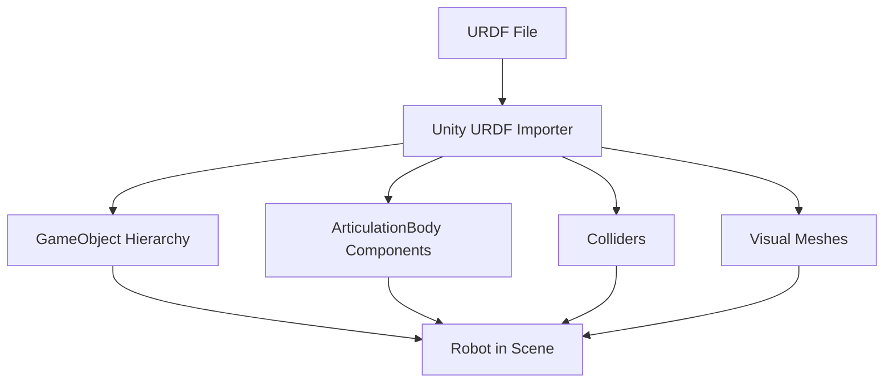

# Chapter 2: High-Fidelity Rendering with Unity

---

## Introduction

While Gazebo excels at physics simulation, **Unity** brings photorealistic rendering and visual fidelity. Unity allows you to create stunning environments where robots interact with lifelike graphics, perfect for:

* Training vision-based AI models
* Generating synthetic training data
* Creating demos and visualizations
* Testing human-robot interaction scenarios

In this chapter, you'll learn to leverage Unity's powerful rendering engine for robotics applications.

---

## Why Unity for Robotics?

### Advantages of Unity

* **Photorealistic rendering**: HDRP (High Definition Render Pipeline)
* **Asset ecosystem**: Millions of ready-to-use 3D models
* **Cross-platform**: Windows, Linux, macOS, mobile, VR/AR
* **Visual scripting**: No-code logic with Unity Visual Scripting
* **Performance**: Highly optimized rendering engine

### Unity vs Gazebo

| Feature | Unity | Gazebo |
|---------|-------|--------|
| **Visual Quality** | Photorealistic | Good |
| **Physics Accuracy** | Good | Excellent |
| **Asset Library** | Massive | Limited |
| **Learning Curve** | Moderate | Steep |
| **ROS Integration** | Via Unity Robotics Hub | Native |
| **Real-time Ray Tracing** | Yes | No |

**Best Practice**: Use Gazebo for physics-critical tasks, Unity for vision and visualization.

---

## Installing Unity

### Unity Hub Installation

**Step 1: Download Unity Hub**

```bash
# Download from Unity website
wget https://public-cdn.cloud.unity3d.com/hub/prod/UnityHubSetup.AppImage

# Make executable
chmod +x UnityHubSetup.AppImage

# Run
./UnityHubSetup.AppImage
```

**Step 2: Install Unity Editor**

* Open Unity Hub
* Go to **Installs** → **Install Editor**
* Select **Unity 2022.3 LTS** (Long Term Support)
* Add modules:
  * Linux Build Support
  * Documentation
  * Microsoft Visual Studio Community

**Step 3: Create New Project**

* Click **New Project**
* Select **3D (HDRP)** template
* Name: `RoboticsSimulation`
* Click **Create Project**

---

## Unity Robotics Hub

**Unity Robotics Hub** provides ROS integration and robotics tools.

### Installation

**Step 1: Open Package Manager**

* In Unity: **Window** → **Package Manager**
* Click **+** → **Add package from git URL**

**Step 2: Add Packages**

Add these URLs one by one:

```
https://github.com/Unity-Technologies/ROS-TCP-Connector.git?path=/com.unity.robotics.ros-tcp-connector
https://github.com/Unity-Technologies/URDF-Importer.git?path=/com.unity.robotics.urdf-importer
https://github.com/Unity-Technologies/Unity-Robotics-Hub.git?path=/com.unity.robotics.visualizations
```

**Step 3: Set up ROS Connection**

* Go to **Robotics** → **ROS Settings**
* Set **ROS IP Address**: `127.0.0.1` (localhost)
* Set **ROS Port**: `10000`
* Protocol: **ROS2**

---

## Importing Robot Models

### Method 1: Import URDF Directly

**Step 1: Prepare URDF**

Ensure your URDF has:
* Correct mesh file paths
* Proper material definitions
* Joint limits defined

**Step 2: Import in Unity**

* **Assets** → **Import Robot from URDF**
* Select your `.urdf` file
* Choose import settings:
  * **Axis Type**: Z-Axis
  * **Mesh Decomposer**: VHACD (for complex collisions)

**Step 3: Configure Articulation**

Unity converts URDF joints to **ArticulationBody** components automatically.



### Method 2: Manual Model Creation

**Step 1: Create Hierarchy**

```
Robot (Root)
├── Base
│   ├── Mesh Renderer
│   └── Articulation Body
├── LeftArm
│   ├── UpperArm
│   └── LowerArm
└── RightArm
    ├── UpperArm
    └── LowerArm
```

**Step 2: Add Articulation Bodies**

* Select **Base** object
* **Add Component** → **Articulation Body**
* Set as **Root** articulation
* For child objects, set **Parent Anchor** and **Joint Type**

---

## Creating Realistic Environments

### Setting up HDRP

**High Definition Render Pipeline** provides photorealistic rendering.

**Step 1: Configure HDRP**

* **Edit** → **Project Settings** → **HDRP**
* Enable:
  * Screen Space Reflections
  * Screen Space Global Illumination
  * Volumetric Fog
  * Motion Blur

**Step 2: Add Post-Processing**

* Create empty GameObject: **Post Processing Volume**
* Add **Volume** component
* Check **Is Global**
* Create new **Volume Profile**
* Add overrides:
  * Bloom
  * Depth of Field
  * Color Adjustments
  * Ambient Occlusion

### Lighting Setup

**Three-Point Lighting for Robots**

```csharp
// Key Light (Main)
var keyLight = new GameObject("Key Light").AddComponent<Light>();
keyLight.type = LightType.Directional;
keyLight.intensity = 1.5f;
keyLight.transform.rotation = Quaternion.Euler(50, -30, 0);

// Fill Light (Soften shadows)
var fillLight = new GameObject("Fill Light").AddComponent<Light>();
fillLight.type = LightType.Directional;
fillLight.intensity = 0.5f;
fillLight.transform.rotation = Quaternion.Euler(30, 110, 0);

// Rim Light (Outline)
var rimLight = new GameObject("Rim Light").AddComponent<Light>();
rimLight.type = LightType.Directional;
rimLight.intensity = 0.8f;
rimLight.transform.rotation = Quaternion.Euler(30, 180, 0);
```

### Creating Environments

**Indoor Environment Example**

* Add **Plane** for floor
* Import modular wall pieces from Asset Store
* Add furniture and props
* Place lights for ambiance
* Add **Reflection Probe** for accurate reflections

**Asset Store Resources**:

* **Polygon Office Pack**: Modern office environment
* **Warehouse Kit**: Industrial settings
* **Sci-Fi Lab**: Futuristic environments

---

## Unity-ROS 2 Communication

### ROS TCP Endpoint Setup

**On ROS 2 Side (Ubuntu)**:

```bash
# Install ROS TCP Endpoint
cd ~/ros2_ws/src
git clone https://github.com/Unity-Technologies/ROS-TCP-Endpoint
cd ~/ros2_ws
colcon build --packages-select ros_tcp_endpoint
source install/setup.bash

# Launch endpoint
ros2 run ros_tcp_endpoint default_server_endpoint --ros-args -p ROS_IP:=0.0.0.0
```

**On Unity Side**:

* **Robotics** → **ROS Settings**
* Verify connection: Click **Test Connection**

### Publishing Messages from Unity

**C# Script Example**:

```csharp
using UnityEngine;
using Unity.Robotics.ROSTCPConnector;
using RosMessageTypes.Geometry;

public class RobotPositionPublisher : MonoBehaviour
{
    ROSConnection ros;
    public string topicName = "robot_position";
    public float publishRate = 10f;
    
    private float timeElapsed;
    
    void Start()
    {
        ros = ROSConnection.GetOrCreateInstance();
        ros.RegisterPublisher<PoseMsg>(topicName);
    }
    
    void Update()
    {
        timeElapsed += Time.deltaTime;
        
        if (timeElapsed > 1f / publishRate)
        {
            PoseMsg pose = new PoseMsg(
                new PointMsg(
                    transform.position.x,
                    transform.position.y,
                    transform.position.z
                ),
                new QuaternionMsg(
                    transform.rotation.x,
                    transform.rotation.y,
                    transform.rotation.z,
                    transform.rotation.w
                )
            );
            
            ros.Publish(topicName, pose);
            timeElapsed = 0;
        }
    }
}
```

### Subscribing to ROS Messages

```csharp
using UnityEngine;
using Unity.Robotics.ROSTCPConnector;
using RosMessageTypes.Geometry;

public class VelocitySubscriber : MonoBehaviour
{
    public string topicName = "cmd_vel";
    
    void Start()
    {
        ROSConnection.GetOrCreateInstance().Subscribe<TwistMsg>(
            topicName, 
            ReceiveVelocity
        );
    }
    
    void ReceiveVelocity(TwistMsg velocityMessage)
    {
        float linearX = (float)velocityMessage.linear.x;
        float angularZ = (float)velocityMessage.angular.z;
        
        // Apply to robot
        ApplyVelocity(linearX, angularZ);
    }
    
    void ApplyVelocity(float linear, float angular)
    {
        // Your robot control logic here
        Debug.Log($"Received velocity: linear={linear}, angular={angular}");
    }
}
```

---

## Camera Systems

### RGB Camera

```csharp
using UnityEngine;
using Unity.Robotics.ROSTCPConnector;
using RosMessageTypes.Sensor;

public class CameraPublisher : MonoBehaviour
{
    public Camera robotCamera;
    public string topicName = "camera/image_raw";
    public int publishRate = 30;
    
    private ROSConnection ros;
    private RenderTexture renderTexture;
    private Texture2D texture2D;
    
    void Start()
    {
        ros = ROSConnection.GetOrCreateInstance();
        ros.RegisterPublisher<ImageMsg>(topicName);
        
        renderTexture = new RenderTexture(640, 480, 24);
        robotCamera.targetTexture = renderTexture;
        texture2D = new Texture2D(640, 480, TextureFormat.RGB24, false);
        
        InvokeRepeating("PublishImage", 0f, 1f / publishRate);
    }
    
    void PublishImage()
    {
        RenderTexture.active = renderTexture;
        texture2D.ReadPixels(new Rect(0, 0, 640, 480), 0, 0);
        texture2D.Apply();
        
        ImageMsg message = new ImageMsg
        {
            header = new RosMessageTypes.Std.HeaderMsg
            {
                frame_id = "camera_link"
            },
            height = 480,
            width = 640,
            encoding = "rgb8",
            step = 640 * 3,
            data = texture2D.GetRawTextureData()
        };
        
        ros.Publish(topicName, message);
    }
}
```

### Depth Camera

```csharp
public class DepthCameraPublisher : MonoBehaviour
{
    public Camera depthCamera;
    public Shader depthShader;
    
    void Start()
    {
        depthCamera.depthTextureMode = DepthTextureMode.Depth;
        depthCamera.SetReplacementShader(depthShader, "RenderType");
    }
    
    // Similar to RGB camera but publish depth data
}
```

---

## Articulation Body Control

### Joint Control Script

```csharp
using UnityEngine;

public class ArticulationJointController : MonoBehaviour
{
    private ArticulationBody[] joints;
    
    void Start()
    {
        joints = GetComponentsInChildren<ArticulationBody>();
    }
    
    public void SetJointPosition(int jointIndex, float targetPosition)
    {
        if (jointIndex >= 0 && jointIndex < joints.Length)
        {
            ArticulationBody joint = joints[jointIndex];
            
            var drive = joint.xDrive;
            drive.target = targetPosition * Mathf.Rad2Deg;
            joint.xDrive = drive;
        }
    }
    
    public void SetJointVelocity(int jointIndex, float targetVelocity)
    {
        if (jointIndex >= 0 && jointIndex < joints.Length)
        {
            ArticulationBody joint = joints[jointIndex];
            
            var drive = joint.xDrive;
            drive.targetVelocity = targetVelocity * Mathf.Rad2Deg;
            joint.xDrive = drive;
        }
    }
    
    public float GetJointPosition(int jointIndex)
    {
        if (jointIndex >= 0 && jointIndex < joints.Length)
        {
            return joints[jointIndex].jointPosition[0];
        }
        return 0f;
    }
}
```

---

## Synthetic Data Generation

### Random Environment Generation

```csharp
using UnityEngine;
using System.Collections.Generic;

public class RandomEnvironmentGenerator : MonoBehaviour
{
    public GameObject[] obstaclePrefabs;
    public int numberOfObstacles = 20;
    public Vector3 spawnArea = new Vector3(10, 0, 10);
    
    void Start()
    {
        GenerateEnvironment();
    }
    
    public void GenerateEnvironment()
    {
        // Clear existing obstacles
        foreach (Transform child in transform)
        {
            Destroy(child.gameObject);
        }
        
        // Spawn random obstacles
        for (int i = 0; i < numberOfObstacles; i++)
        {
            Vector3 randomPosition = new Vector3(
                Random.Range(-spawnArea.x / 2, spawnArea.x / 2),
                0,
                Random.Range(-spawnArea.z / 2, spawnArea.z / 2)
            );
            
            GameObject prefab = obstaclePrefabs[Random.Range(0, obstaclePrefabs.Length)];
            GameObject obstacle = Instantiate(prefab, randomPosition, Quaternion.identity);
            obstacle.transform.parent = transform;
            
            // Random rotation
            obstacle.transform.rotation = Quaternion.Euler(0, Random.Range(0, 360), 0);
            
            // Random scale
            float scale = Random.Range(0.5f, 2f);
            obstacle.transform.localScale = Vector3.one * scale;
        }
    }
}
```

### Domain Randomization

```csharp
public class DomainRandomizer : MonoBehaviour
{
    public Light[] lights;
    public Material[] floorMaterials;
    public GameObject floor;
    
    void Start()
    {
        InvokeRepeating("Randomize", 0f, 5f);
    }
    
    void Randomize()
    {
        // Randomize lighting
        foreach (Light light in lights)
        {
            light.intensity = Random.Range(0.5f, 2f);
            light.colorTemperature = Random.Range(2000f, 10000f);
        }
        
        // Randomize floor material
        if (floor != null && floorMaterials.Length > 0)
        {
            floor.GetComponent<Renderer>().material = 
                floorMaterials[Random.Range(0, floorMaterials.Length)];
        }
        
        // Randomize object positions slightly
        foreach (Transform child in transform)
        {
            if (child.gameObject.CompareTag("Movable"))
            {
                child.position += new Vector3(
                    Random.Range(-0.1f, 0.1f),
                    0,
                    Random.Range(-0.1f, 0.1f)
                );
            }
        }
    }
}
```

---

## Performance Optimization

### Optimization Techniques

**1. Occlusion Culling**

* **Window** → **Rendering** → **Occlusion Culling**
* Bake occlusion data for static objects

**2. Level of Detail (LOD)**

```csharp
// Add LOD Group component
LODGroup lodGroup = gameObject.AddComponent<LODGroup>();

LOD[] lods = new LOD[3];
lods[0] = new LOD(0.6f, new Renderer[] { highDetailRenderer });
lods[1] = new LOD(0.3f, new Renderer[] { mediumDetailRenderer });
lods[2] = new LOD(0.1f, new Renderer[] { lowDetailRenderer });

lodGroup.SetLODs(lods);
```

**3. Batch Static Objects**

* Select static objects
* Check **Static** in Inspector
* Enable **Batching Static**

**4. Reduce Draw Calls**

* Use **GPU Instancing** for repeated objects
* Combine meshes where possible
* Use texture atlases

---

## Building Complete Simulation

### Example: Warehouse Robot Simulation

**Components**:

* Warehouse environment with shelves
* Mobile robot with camera and LIDAR
* ROS 2 integration for navigation commands
* Real-time visualization of sensor data

**Workflow**:

1. Design warehouse in Unity
2. Import robot URDF
3. Add camera and LIDAR sensors
4. Create ROS publisher/subscriber scripts
5. Test with ROS 2 navigation stack
6. Generate synthetic training data

---

## Practical Projects

### Project 2.1: Photorealistic Robot Visualization

* Import a humanoid robot URDF
* Create a modern office environment
* Set up HDRP lighting
* Add camera controls for viewing
* Publish robot joint states to ROS 2

### Project 2.2: Multi-Camera System

* Create robot with multiple cameras (front, side, top)
* Publish all camera feeds to ROS 2
* Implement camera switching in Unity UI
* Record synchronized camera data

### Project 2.3: Dynamic Environment Generator

* Build random obstacle generator
* Implement domain randomization
* Create data collection pipeline
* Generate 1000+ training images with labels

---

## Debugging Unity-ROS Communication

### Common Issues

**Issue 1: ROS Connection Failed**

* Check ROS TCP Endpoint is running
* Verify IP address and port
* Check firewall settings

**Issue 2: Messages Not Received**

* Verify topic names match exactly
* Check message type definitions
* Use `ros2 topic echo` to verify ROS side

**Issue 3: Poor Performance**

* Reduce publish rate
* Optimize mesh complexity
* Disable unnecessary visual effects

### Debugging Tools

```bash
# Check Unity → ROS communication
ros2 topic list
ros2 topic hz /unity_topic

# Monitor endpoint
ros2 run ros_tcp_endpoint default_server_endpoint --ros-args -p ROS_IP:=0.0.0.0 -r __log_level:=debug
```

---

## Key Takeaways

* Unity provides photorealistic rendering for robotics
* Unity Robotics Hub enables seamless ROS 2 integration
* URDF importer simplifies robot model import
* HDRP enables high-quality visual output
* Synthetic data generation reduces real-world data needs
* ArticulationBody provides physics-based joint control
* Domain randomization improves sim-to-real transfer

---

## Further Resources

* Unity Robotics Hub: https://github.com/Unity-Technologies/Unity-Robotics-Hub
* Unity Learn: https://learn.unity.com
* Unity Asset Store: https://assetstore.unity.com
* HDRP Documentation: https://docs.unity3d.com/Packages/com.unity.render-pipelines.high-definition@latest

---

**Next Module**: [Module 3 - The AI-Robot Brain (NVIDIA Isaac) →](/docs/module3/overview)