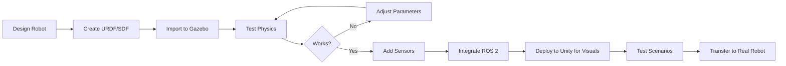

# Module 2: The Digital Twin (Gazebo & Unity)

**Focus**: Physics simulation and environment building

---

## Overview

Before deploying robots in the real world, we test them in **digital twins**—virtual replicas that obey the same physical laws. Module 2 teaches you to create photorealistic simulations where robots can safely learn, fail, and iterate without risk of damage or injury.

A digital twin is more than just a 3D model. It's a complete virtual environment that simulates:

* **Physics**: Gravity, friction, collisions, momentum
* **Sensors**: Cameras, LIDAR, IMUs, depth sensors
* **Actuators**: Motors, servos, hydraulics
* **Environment**: Terrain, obstacles, dynamic objects

This module focuses on two powerful simulation platforms:

* **Gazebo**: Industry-standard robot simulator with accurate physics
* **Unity**: High-fidelity rendering engine for photorealistic environments

---

## Why Simulation Matters

### The Cost of Reality

Training robots purely in the physical world is:

* **Expensive**: Hardware wear, breakage, and replacement
* **Dangerous**: Untested behaviors can cause injury
* **Slow**: Real-time constraints limit training iterations
* **Limited**: Difficult to test edge cases and rare scenarios

### Benefits of Simulation

* **Rapid iteration**: Test thousands of scenarios in parallel
* **Safety**: No risk to humans or equipment
* **Cost-effective**: No hardware damage
* **Reproducibility**: Exact scenario replay for debugging
* **Edge case testing**: Simulate rare but critical situations
* **Parallelization**: Run multiple simulations simultaneously

### The Sim-to-Real Challenge

The main challenge: **reality gap** between simulation and the real world.

Simulations simplify:
* Contact dynamics (friction, slip)
* Sensor noise and failures
* Actuator delays and imperfections
* Environmental variability

**Solutions**:
* Domain randomization
* High-fidelity physics engines
* Realistic sensor simulation
* Fine-tuning with real-world data

---

## Module Contents

### Chapter 1: Robot Simulation with Gazebo

* Gazebo architecture and plugins
* World files and model descriptions (SDF format)
* Physics engines (ODE, Bullet, DART)
* Sensor simulation (cameras, LIDAR, IMU)
* Integration with ROS 2

[Go to Chapter 1 →](/docs/module2/module2-chapter1)

---

### Chapter 2: High-Fidelity Rendering with Unity

* Unity for robotics visualization
* Importing robot models
* Creating realistic environments
* Camera and lighting systems
* Unity-ROS 2 integration

[Go to Chapter 2 →](/docs/module2/module2-chapter2)

---

## Learning Objectives

By the end of this module, you will be able to:

* ✅ Set up and configure Gazebo simulation environments
* ✅ Create custom worlds and robot models using SDF
* ✅ Simulate various sensors with realistic noise models
* ✅ Configure physics engines for accurate dynamics
* ✅ Build photorealistic environments in Unity
* ✅ Integrate Unity with ROS 2 for real-time communication
* ✅ Test robot behaviors in complex scenarios
* ✅ Bridge simulation to real hardware

---

## Software Requirements

### Gazebo

* **Gazebo Fortress** or **Gazebo Harmonic** (recommended)
* **ROS 2 Humble** or **Iron**
* **gazebo_ros_pkgs**: ROS 2 integration packages

### Unity

* **Unity 2022.3 LTS** or newer
* **Unity Robotics Hub**: ROS-Unity integration
* **HDRP** (High Definition Render Pipeline): For photorealistic rendering

---

## Hardware Requirements

Simulation is computationally intensive:

* **GPU**: NVIDIA RTX 3060 or better (for Unity rendering)
* **CPU**: Intel i7 or AMD Ryzen 7 (8+ cores recommended)
* **RAM**: 16 GB minimum, 32 GB recommended
* **Storage**: 50 GB free space for Unity assets

---

## Simulation Workflow

---

## Hands-On Projects

This module includes practical projects:

* **Project 1**: Build a custom Gazebo world with obstacles
* **Project 2**: Simulate a mobile robot with LIDAR and cameras
* **Project 3**: Create a Unity environment for a humanoid robot
* **Project 4**: Implement sensor fusion from simulated data
* **Final Project**: Complete digital twin of a humanoid in complex environment

---

## Assessment

* Gazebo world creation (25%)
* Sensor simulation assignment (25%)
* Unity visualization project (25%)
* End-to-end digital twin project (25%)

---

## Simulation vs Reality Comparison

| Metric | Gazebo | Unity | Real World |
|--------|--------|-------|------------|
| **Physics Accuracy** | High | Medium | Perfect |
| **Visual Realism** | Medium | Very High | Perfect |
| **Speed** | Real-time | Real-time | Real-time |
| **Cost** | Free | Free/Paid | Expensive |
| **Safety** | 100% safe | 100% safe | Risk present |
| **Sensor Noise** | Configurable | Configurable | Unpredictable |

---

**Ready to build your digital twin? Let's simulate!** 🎮🤖