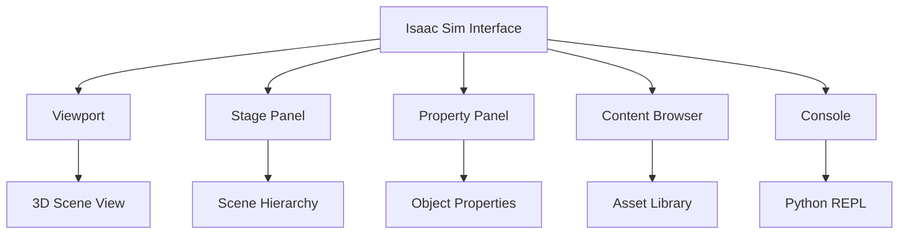

# Chapter 1: Introduction to the NVIDIA Isaac Platform

---

## Introduction

**NVIDIA Isaac Sim** is a scalable robotics simulation platform built on Omniverse. It combines photorealistic rendering with accurate physics to create training environments that closely mirror reality. This chapter guides you through setup, core concepts, and creating your first Isaac simulation.

---

## Understanding Omniverse

### What is Omniverse?

**NVIDIA Omniverse** is a platform for 3D design collaboration and simulation built on:

* **USD (Universal Scene Description)**: Pixar's open-source format
* **RTX Ray Tracing**: Real-time photorealistic rendering
* **PhysX**: Advanced physics simulation
* **Nucleus**: Collaboration server for shared assets

Isaac Sim is an Omniverse application specifically designed for robotics.

### Key Concepts

**USD (Universal Scene Description)**:
* Scene graph format supporting hierarchy, instancing, variants
* Enables non-destructive editing and layering
* Industry standard (Pixar, ILM, major studios)

**Prims (Primitives)**:
* Basic building blocks in USD (meshes, cameras, lights)
* Organized in hierarchical tree structure

**Stages**:
* Container for scene data
* Can load and compose multiple USD files

---

## Installing Isaac Sim

### System Requirements

**Minimum**:
* GPU: RTX 3070 (8GB VRAM)
* CPU: Intel i7 / AMD Ryzen 7
* RAM: 32 GB
* OS: Ubuntu 22.04 / Windows 10/11

**Recommended**:
* GPU: RTX 4080/4090 (16-24GB VRAM)
* CPU: Intel i9 / AMD Ryzen 9
* RAM: 64 GB
* OS: Ubuntu 22.04 LTS

### Installation Steps

**Step 1: Install Omniverse Launcher**

```bash
# Download from NVIDIA
wget https://install.launcher.omniverse.nvidia.com/installers/omniverse-launcher-linux.AppImage

# Make executable
chmod +x omniverse-launcher-linux.AppImage

# Run launcher
./omniverse-launcher-linux.AppImage
```

**Step 2: Install Isaac Sim**

* Open Omniverse Launcher
* Go to **Exchange** tab
* Search for **Isaac Sim**
* Click **Install**
* Wait for download (approx. 20 GB)

**Step 3: Install Dependencies**

```bash
# Install ROS 2 Humble (if not already installed)
sudo apt install ros-humble-desktop

# Install Isaac Sim Python dependencies
cd ~/.local/share/ov/pkg/isaac_sim-*
./python.sh -m pip install -r requirements.txt
```

**Step 4: Verify Installation**

```bash
# Launch Isaac Sim
~/.local/share/ov/pkg/isaac_sim-*/isaac-sim.sh

# Or from Omniverse Launcher
# Click "Launch" on Isaac Sim
```

---

## Isaac Sim Interface

### Main Windows

**Viewport**:
* 3D rendering of the scene
* Camera controls (pan, zoom, rotate)
* Play/Pause simulation

**Stage**:
* Hierarchical tree of scene objects (Prims)
* Similar to Unity Hierarchy or Blender Outliner

**Property**:
* Properties of selected Prim
* Transform, physics, materials

**Content Browser**:
* Asset library
* Local and Nucleus server assets

**Console**:
* Python scripting interface
* Error messages and logs



---

## Creating Your First Scene

### Adding Objects

**Method 1: Via Menu**

* **Create** → **Mesh** → **Cube**
* Object appears at origin (0, 0, 0)

**Method 2: Via Python**

```python
import omni.isaac.core.utils.prims as prim_utils

# Create cube
cube_prim = prim_utils.create_prim(
    "/World/Cube",
    "Cube",
    position=(0, 0, 1),
    scale=(0.5, 0.5, 0.5)
)
```

### Setting Up Ground Plane

```python
from omni.isaac.core.utils.stage import add_reference_to_stage

# Add default ground plane
add_reference_to_stage(
    usd_path="omniverse://localhost/NVIDIA/Assets/Isaac/2023.1.1/Isaac/Environments/Grid/default_environment.usd",
    prim_path="/World/GroundPlane"
)
```

### Adding Lighting

```python
from pxr import UsdLux

# Create distant light (sun)
light_prim = prim_utils.create_prim(
    "/World/Sun",
    "DistantLight"
)

# Set light properties
light = UsdLux.DistantLight(light_prim)
light.CreateIntensityAttr(1000)
light.CreateAngleAttr(0.53)  # Sun angular diameter
```

---

## Importing Robot Models

### From URDF

**Python Script**:

```python
from omni.isaac.core.utils.extensions import enable_extension
enable_extension("omni.importer.urdf")

from omni.importer.urdf import _urdf

# Import URDF
urdf_interface = _urdf.acquire_urdf_interface()

import_config = _urdf.ImportConfig()
import_config.merge_fixed_joints = False
import_config.convex_decomp = True
import_config.import_inertia_tensor = True
import_config.fix_base = False

result, prim_path = urdf_interface.parse_urdf(
    "/path/to/robot.urdf",
    "/World/Robot",
    import_config
)

print(f"Robot imported at: {prim_path}")
```

### From USD

```python
add_reference_to_stage(
    usd_path="omniverse://localhost/NVIDIA/Assets/Isaac/2023.1.1/Isaac/Robots/Franka/franka_alt_fingers.usd",
    prim_path="/World/Franka"
)
```

### Isaac Asset Library

Isaac Sim includes pre-built robots:

* **Franka Emika Panda**: Robotic arm
* **Carter**: Differential drive robot
* **Jetbot**: Small wheeled robot
* **Quadruped**: Legged robot
* **Humanoid**: Bipedal robot

---

## Physics Configuration

### Rigid Bodies

**Enable Physics**:

```python
from pxr import UsdPhysics

# Get cube prim
cube = stage.GetPrimAtPath("/World/Cube")

# Add rigid body
UsdPhysics.RigidBodyAPI.Apply(cube)

# Add collision
UsdPhysics.CollisionAPI.Apply(cube)

# Add mass
mass_api = UsdPhysics.MassAPI.Apply(cube)
mass_api.CreateMassAttr(1.0)
```

### Physics Scene Settings

```python
# Set physics scene parameters
physics_scene = UsdPhysics.Scene.Define(stage, "/World/PhysicsScene")
physics_scene.CreateGravityDirectionAttr().Set((0, 0, -1))
physics_scene.CreateGravityMagnitudeAttr().Set(9.81)

# PhysX parameters
from pxr import PhysxSchema
physx_scene = PhysxSchema.PhysxSceneAPI.Apply(physics_scene.GetPrim())
physx_scene.CreateEnableCCDAttr(True)  # Continuous Collision Detection
physx_scene.CreateEnableStabilizationAttr(True)
physx_scene.CreateEnableGPUDynamicsAttr(True)  # GPU acceleration
```

---

## Camera and Sensors

### Adding Camera

```python
from omni.isaac.core.utils.prims import create_prim

# Create camera
camera_prim = create_prim(
    "/World/Camera",
    "Camera",
    position=(3, 3, 2),
    rotation=(0, 45, 45)  # Look at origin
)

# Camera properties
from pxr import UsdGeom
camera = UsdGeom.Camera(camera_prim)
camera.CreateFocalLengthAttr(24.0)
camera.CreateFocusDistanceAttr(400)
```

### Adding LIDAR

```python
from omni.isaac.range_sensor import _range_sensor

# Create rotating lidar
result, sensor_path = omni.kit.commands.execute(
    "RangeSensorCreateLidar",
    path="/World/Lidar",
    parent="/World/Robot",
    min_range=0.4,
    max_range=100.0,
    draw_points=True,
    draw_lines=False,
    horizontal_fov=360.0,
    vertical_fov=30.0,
    horizontal_resolution=0.4,
    vertical_resolution=4.0,
    rotation_rate=20.0,
    high_lod=False,
    yaw_offset=0.0,
    enable_semantics=False
)
```

---

## Python Scripting in Isaac Sim

### Standalone Python Script

```python
from omni.isaac.kit import SimulationApp

# Launch Isaac Sim
simulation_app = SimulationApp({"headless": False})

from omni.isaac.core import World
from omni.isaac.core.objects import DynamicCuboid

# Create world
world = World()

# Add cube
cube = world.scene.add(
    DynamicCuboid(
        prim_path="/World/Cube",
        name="cube",
        position=(0, 0, 2),
        size=0.5,
        color=(1, 0, 0)  # Red
    )
)

# Reset world
world.reset()

# Run simulation
for i in range(1000):
    world.step(render=True)
    
    # Get cube position
    position, orientation = cube.get_world_pose()
    print(f"Cube position: {position}")

simulation_app.close()
```

### Extension Script

```python
import omni.ext
import omni.ui as ui

class MyExtension(omni.ext.IExt):
    def on_startup(self, ext_id):
        print("Extension started")
        
        # Create custom UI
        self._window = ui.Window("My Robot Controller", width=300, height=200)
        with self._window.frame:
            with ui.VStack():
                ui.Label("Robot Control Panel")
                ui.Button("Start Simulation", clicked_fn=self.start_sim)
                ui.Button("Stop Simulation", clicked_fn=self.stop_sim)
    
    def on_shutdown(self):
        print("Extension stopped")
    
    def start_sim(self):
        print("Starting simulation...")
    
    def stop_sim(self):
        print("Stopping simulation...")
```

---

## ROS 2 Integration

### Publishing Robot State

```python
from omni.isaac.core.utils.extensions import enable_extension
enable_extension("omni.isaac.ros2_bridge")

import omni.graph.core as og

# Create ROS2 context
keys = og.Controller.Keys
(ros2_context_graph, _, _, _) = og.Controller.edit(
    {"graph_path": "/ActionGraph", "evaluator_name": "execution"},
    {
        keys.CREATE_NODES: [
            ("Context", "omni.isaac.ros2_bridge.ROS2Context"),
            ("PublishJointState", "omni.isaac.ros2_bridge.ROS2PublishJointState"),
        ],
        keys.CONNECT: [
            ("Context.outputs:context", "PublishJointState.inputs:context"),
        ],
        keys.SET_VALUES: [
            ("PublishJointState.inputs:topicName", "/joint_states"),
            ("PublishJointState.inputs:targetPrim", ["/World/Robot"]),
        ],
    },
)
```

### Subscribing to Commands

```python
# Subscribe to cmd_vel
(graph, _, _, _) = og.Controller.edit(
    {"graph_path": "/CmdVelGraph", "evaluator_name": "execution"},
    {
        keys.CREATE_NODES: [
            ("Context", "omni.isaac.ros2_bridge.ROS2Context"),
            ("SubscribeTwist", "omni.isaac.ros2_bridge.ROS2SubscribeTwist"),
            ("DiffDrive", "omni.isaac.wheeled_robots.DifferentialController"),
        ],
        keys.CONNECT: [
            ("Context.outputs:context", "SubscribeTwist.inputs:context"),
            ("SubscribeTwist.outputs:linearVelocity", "DiffDrive.inputs:linearVelocity"),
            ("SubscribeTwist.outputs:angularVelocity", "DiffDrive.inputs:angularVelocity"),
        ],
        keys.SET_VALUES: [
            ("SubscribeTwist.inputs:topicName", "/cmd_vel"),
            ("DiffDrive.inputs:targetPrim", "/World/Robot"),
        ],
    },
)
```

---

## Action Graph System

**Action Graphs** provide visual programming for robotics logic.

### Creating Action Graph

**Via UI**:

* **Window** → **Visual Scripting** → **Action Graph**
* Right-click → **Add Node**
* Connect nodes by dragging ports

### Common Nodes

* **On Playback Tick**: Triggers every simulation step
* **Read Transform**: Get object position/rotation
* **Write Transform**: Set object position/rotation
* **Constant**: Fixed values
* **Math nodes**: Add, multiply, sin, cos, etc.


---

## Saving and Loading Scenes

### Save Scene

```python
import omni.usd

# Save current stage
omni.usd.get_context().save_stage()

# Save as new file
omni.usd.get_context().save_as_stage("/path/to/scene.usd")
```

### Load Scene

```python
# Open USD file
omni.usd.get_context().open_stage("/path/to/scene.usd")
```

---

## Practical Projects

### Project 1.1: Basic Scene Creation

* Create a warehouse environment with:
  * Ground plane
  * Multiple boxes (obstacles)
  * Lighting setup
  * Save as USD file

### Project 1.2: Robot Import and Control

* Import a robot URDF
* Add physics properties
* Create Python script to move robot joints
* Visualize in Isaac Sim

### Project 1.3: ROS 2 Bridge

* Set up ROS 2 context in Isaac Sim
* Publish camera images to ROS 2
* Subscribe to velocity commands
* Test with ROS 2 command line tools

---

## Debugging Tips

* **Simulation runs slow**: Reduce rendering quality, enable GPU dynamics
* **Physics unstable**: Increase solver iterations, enable CCD
* **URDF import fails**: Check mesh file paths, simplify collision geometry
* **ROS connection issues**: Verify ROS 2 domain ID, check firewall

### Useful Commands

```bash
# Check Isaac Sim logs
tail -f ~/.nvidia-omniverse/logs/Kit/Isaac-Sim/*/kit.log

# Monitor USD file
usdview /path/to/scene.usd

# ROS 2 diagnostics
ros2 topic list
ros2 node list
```

---

## Key Takeaways

* Isaac Sim is built on Omniverse and USD format
* PhysX 5 provides accurate physics simulation
* Python API enables programmatic scene creation
* ROS 2 integration is native via action graphs
* Sensors (camera, LIDAR, IMU) are easily configured
* USD format enables collaboration and asset reuse

---

## Further Resources

* Isaac Sim Documentation: https://docs.omniverse.nvidia.com/isaacsim/latest
* USD Documentation: https://graphics.pixar.com/usd/docs/index.html
* PhysX Documentation: https://nvidia-omniverse.github.io/PhysX/physx/5.1.0/index.html
* Isaac Sim Forums: https://forums.developer.nvidia.com/c/omniverse/simulation/69

---

**Next**: [Chapter 2 - AI-Powered Perception and Navigation →](/docs/module3/module3-chapter2)