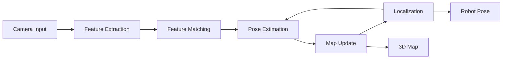
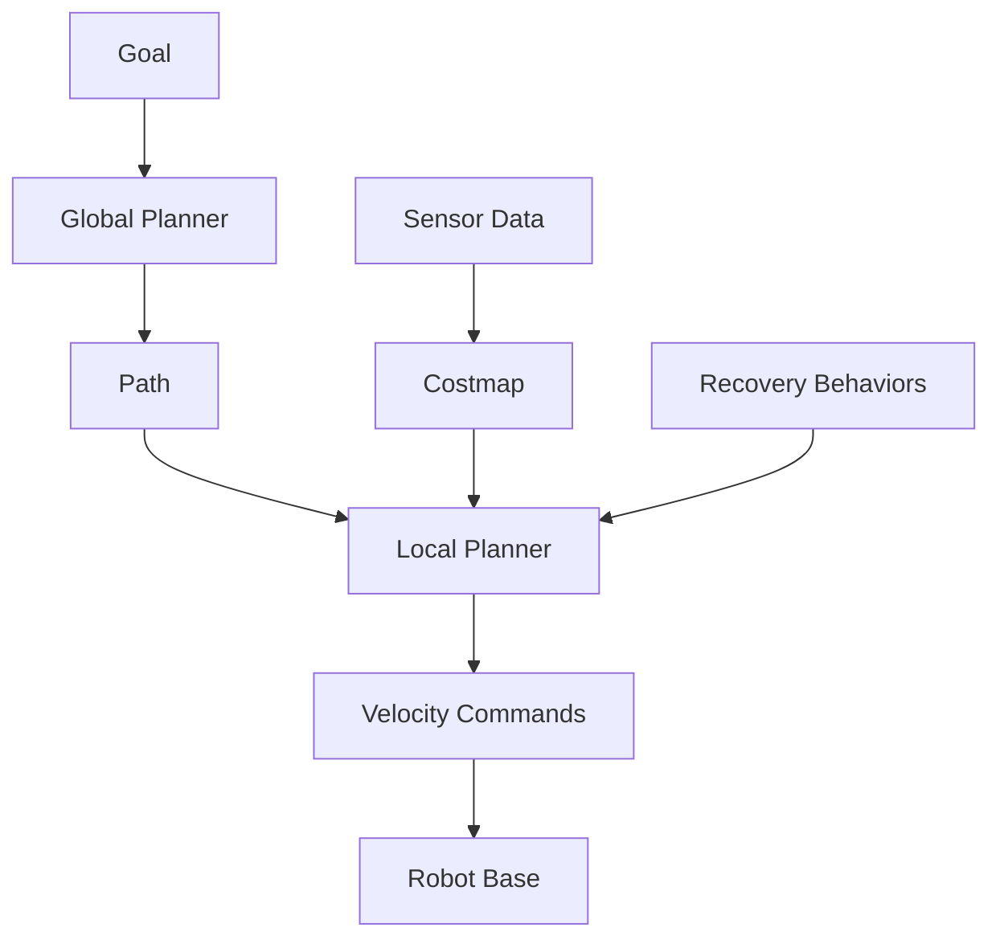

# Chapter 2: AI-Powered Perception and Navigation

---

## Introduction

Perception is the foundation of autonomous robots. **Isaac ROS** provides GPU-accelerated perception packages that enable robots to see, understand, and navigate their environment in real-time. This chapter covers Visual SLAM, object detection, and navigation on NVIDIA Jetson devices.

---

## Isaac ROS Overview

**Isaac ROS** is a collection of hardware-accelerated ROS 2 packages optimized for NVIDIA GPUs. These "GEMs" (GPU-Enhanced Modules) provide:

* **10-100x speedup** over CPU implementations
* **Lower latency** for real-time decision making
* **Higher throughput** for processing multiple sensors
* **Power efficiency** on Jetson edge devices

### Available Isaac ROS Packages

* `isaac_ros_visual_slam`: Visual SLAM and odometry
* `isaac_ros_dnn_inference`: Deep learning inference
* `isaac_ros_image_proc`: Image processing pipelines
* `isaac_ros_apriltag`: Fiducial marker detection
* `isaac_ros_depth_segmentation`: Depth-based segmentation
* `isaac_ros_nvblox`: 3D reconstruction and mapping
* `isaac_ros_object_detection`: Object detection pipelines

---

## Setting Up Jetson

### Jetson Platform Options

| Device | CUDA Cores | AI Performance | RAM | Price |
|--------|------------|----------------|-----|-------|
| **Orin Nano** | 1024 | 40 TOPS | 8GB | $249 |
| **Orin NX** | 1024-2048 | 70-100 TOPS | 8-16GB | $399-$599 |
| **Orin AGX** | 2048 | 275 TOPS | 32-64GB | $1,999-$2,499 |

### Initial Setup

**Step 1: Flash JetPack**

* Download **NVIDIA SDK Manager**
* Connect Jetson via USB
* Flash **JetPack 5.1.2** or later
* Includes: Ubuntu 20.04, CUDA, TensorRT, cuDNN

**Step 2: Install ROS 2**

```bash
# Update system
sudo apt update && sudo apt upgrade

# Install ROS 2 Humble
sudo apt install ros-humble-desktop

# Source ROS 2
echo "source /opt/ros/humble/setup.bash" >> ~/.bashrc
source ~/.bashrc
```

**Step 3: Install Isaac ROS**

```bash
# Install dependencies
sudo apt-get install python3-rosdep python3-rosinstall-generator python3-vcstool build-essential

# Create workspace
mkdir -p ~/workspaces/isaac_ros-dev/src
cd ~/workspaces/isaac_ros-dev/src

# Clone Isaac ROS common
git clone https://github.com/NVIDIA-ISAAC-ROS/isaac_ros_common.git

# Initialize rosdep
sudo rosdep init
rosdep update

# Build
cd ~/workspaces/isaac_ros-dev
colcon build --symlink-install
source install/setup.bash
```

---

## Visual SLAM with Isaac ROS

**Visual SLAM** (Simultaneous Localization and Mapping) enables robots to:

* Estimate their position in unknown environments
* Build maps of their surroundings
* Navigate without GPS or external markers

### How Visual SLAM Works



### Installing Visual SLAM

```bash
cd ~/workspaces/isaac_ros-dev/src

# Clone Visual SLAM
git clone https://github.com/NVIDIA-ISAAC-ROS/isaac_ros_visual_slam.git

# Install dependencies
cd ~/workspaces/isaac_ros-dev
rosdep install -i -r --from-paths src --rosdistro humble -y

# Build
colcon build --packages-up-to isaac_ros_visual_slam
source install/setup.bash
```

### Connecting RealSense Camera

```bash
# Install RealSense ROS 2 wrapper
sudo apt install ros-humble-realsense2-camera ros-humble-realsense2-description

# Test camera
ros2 launch realsense2_camera rs_launch.py

# Verify topics
ros2 topic list | grep camera
```

### Running Visual SLAM

```bash
# Launch RealSense with required topics
ros2 launch realsense2_camera rs_launch.py \
    align_depth.enable:=true \
    enable_infra1:=true \
    enable_infra2:=true \
    enable_depth:=true

# In new terminal, launch Visual SLAM
ros2 launch isaac_ros_visual_slam isaac_ros_visual_slam_realsense.launch.py
```

### Visualizing in RViz

```bash
# Launch RViz
ros2 run rviz2 rviz2

# Add displays:
# - TF (to see coordinate frames)
# - Camera (topic: /camera/color/image_raw)
# - PointCloud2 (topic: /visual_slam/vis/slam_odometry)
# - Map (if using Nav2)
```

### Visual SLAM Configuration

```yaml
# visual_slam_params.yaml
visual_slam_node:
  ros__parameters:
    denoise_input_images: true
    rectified_images: true
    enable_imu_fusion: true
    enable_ground_constraint_in_odometry: false
    enable_slam_visualization: true
    enable_landmarks_view: true
    enable_observations_view: true
    map_frame: 'map'
    odom_frame: 'odom'
    base_frame: 'base_link'
    num_cameras: 2
    min_num_images: 10
    image_buffer_size: 50
```

---

## Path Planning with Nav2

**Nav2** (Navigation 2) is the ROS 2 navigation stack. It provides:

* Global path planning
* Local trajectory optimization
* Obstacle avoidance
* Recovery behaviors

### Nav2 Architecture



### Installing Nav2

```bash
sudo apt install ros-humble-navigation2 ros-humble-nav2-bringup
```

### Nav2 Configuration

**nav2_params.yaml**:

```yaml
bt_navigator:
  ros__parameters:
    global_frame: map
    robot_base_frame: base_link
    odom_topic: /visual_slam/tracking/odometry
    
controller_server:
  ros__parameters:
    controller_frequency: 20.0
    FollowPath:
      plugin: "dwb_core::DWBLocalPlanner"
      min_vel_x: 0.0
      max_vel_x: 0.5
      max_vel_theta: 1.0
      min_speed_xy: 0.0
      max_speed_xy: 0.5
      
planner_server:
  ros__parameters:
    expected_planner_frequency: 20.0
    GridBased:
      plugin: "nav2_navfn_planner/NavfnPlanner"
      tolerance: 0.5
      use_astar: false
      
local_costmap:
  local_costmap:
    ros__parameters:
      update_frequency: 5.0
      publish_frequency: 2.0
      global_frame: odom
      robot_base_frame: base_link
      width: 3
      height: 3
      resolution: 0.05
      
global_costmap:
  global_costmap:
    ros__parameters:
      update_frequency: 1.0
      publish_frequency: 1.0
      global_frame: map
      robot_base_frame: base_link
      resolution: 0.05
```

### Launching Nav2

```bash
# Launch Visual SLAM first
ros2 launch isaac_ros_visual_slam isaac_ros_visual_slam_realsense.launch.py

# Launch Nav2
ros2 launch nav2_bringup navigation_launch.py \
    params_file:=/path/to/nav2_params.yaml

# Set initial pose in RViz
# Click "2D Pose Estimate" and click on map

# Send navigation goal
# Click "Nav2 Goal" and click on map
```

---

## Object Detection with DNN Inference

### Installing Isaac ROS DNN Inference

```bash
cd ~/workspaces/isaac_ros-dev/src

# Clone DNN inference
git clone https://github.com/NVIDIA-ISAAC-ROS/isaac_ros_dnn_inference.git

# Build
cd ~/workspaces/isaac_ros-dev
colcon build --packages-up-to isaac_ros_dnn_inference
source install/setup.bash
```

### Using Pre-trained Models

**YOLO Object Detection**:

```bash
# Download model
mkdir -p ~/workspaces/isaac_ros-dev/models
cd ~/workspaces/isaac_ros-dev/models

# Example: Download YOLO model (placeholder - actual download varies)
# Refer to NVIDIA NGC for actual models

# Launch object detection
ros2 launch isaac_ros_dnn_inference isaac_ros_dnn_inference.launch.py \
    model_file_path:=/path/to/model.onnx \
    engine_file_path:=/path/to/model.engine \
    input_binding_names:=['input'] \
    output_binding_names:=['output']
```

### Custom Object Detection Pipeline

```python
import rclpy
from rclpy.node import Node
from sensor_msgs.msg import Image
from vision_msgs.msg import Detection2DArray
from cv_bridge import CvBridge
import cv2

class ObjectDetectionNode(Node):
    def __init__(self):
        super().__init__('object_detection_node')
        
        self.bridge = CvBridge()
        
        # Subscribe to camera
        self.image_sub = self.create_subscription(
            Image,
            '/camera/color/image_raw',
            self.image_callback,
            10
        )
        
        # Subscribe to detections
        self.detection_sub = self.create_subscription(
            Detection2DArray,
            '/detections',
            self.detection_callback,
            10
        )
        
        self.latest_image = None
        
    def image_callback(self, msg):
        self.latest_image = self.bridge.imgmsg_to_cv2(msg, 'bgr8')
    
    def detection_callback(self, msg):
        if self.latest_image is None:
            return
        
        image = self.latest_image.copy()
        
        for detection in msg.detections:
            # Get bounding box
            bbox = detection.bbox
            center_x = int(bbox.center.x)
            center_y = int(bbox.center.y)
            width = int(bbox.size_x)
            height = int(bbox.size_y)
            
            x1 = center_x - width // 2
            y1 = center_y - height // 2
            x2 = center_x + width // 2
            y2 = center_y + height // 2
            
            # Draw box
            cv2.rectangle(image, (x1, y1), (x2, y2), (0, 255, 0), 2)
            
            # Get label
            if detection.results:
                label = detection.results[0].hypothesis.class_id
                cv2.putText(image, label, (x1, y1-10),
                           cv2.FONT_HERSHEY_SIMPLEX, 0.5, (0, 255, 0), 2)
        
        cv2.imshow('Detections', image)
        cv2.waitKey(1)

def main():
    rclpy.init()
    node = ObjectDetectionNode()
    rclpy.spin(node)
    rclpy.shutdown()
```

---

## Depth Processing

### Stereo Depth Estimation

```bash
# Clone stereo image proc
cd ~/workspaces/isaac_ros-dev/src
git clone https://github.com/NVIDIA-ISAAC-ROS/isaac_ros_image_pipeline.git

# Build
cd ~/workspaces/isaac_ros-dev
colcon build --packages-up-to isaac_ros_stereo_image_proc
source install/setup.bash

# Launch stereo processing
ros2 launch isaac_ros_stereo_image_proc isaac_ros_stereo_image_proc.launch.py
```

### Point Cloud Generation

```python
from sensor_msgs.msg import PointCloud2
import numpy as np

class DepthToPointCloud(Node):
    def __init__(self):
        super().__init__('depth_to_pointcloud')
        
        self.depth_sub = self.create_subscription(
            Image,
            '/camera/depth/image_rect_raw',
            self.depth_callback,
            10
        )
        
        self.pc_pub = self.create_publisher(
            PointCloud2,
            '/point_cloud',
            10
        )
    
    def depth_callback(self, depth_msg):
        # Convert depth image to point cloud
        # Implement depth to 3D conversion
        pass
```

---

## 3D Reconstruction with Nvblox

**Nvblox** creates 3D voxel maps for navigation and planning.

```bash
# Install Nvblox
cd ~/workspaces/isaac_ros-dev/src
git clone https://github.com/NVIDIA-ISAAC-ROS/isaac_ros_nvblox.git

# Build
cd ~/workspaces/isaac_ros-dev
colcon build --packages-up-to isaac_ros_nvblox
source install/setup.bash

# Launch
ros2 launch isaac_ros_nvblox isaac_ros_nvblox_realsense.launch.py
```

---

## Practical Projects

### Project 2.1: Visual SLAM Setup

* Connect RealSense camera to Jetson
* Configure and run Isaac ROS Visual SLAM
* Navigate robot while building map
* Save and reload map

### Project 2.2: Autonomous Navigation

* Set up Nav2 with Visual SLAM
* Create costmap configuration
* Test navigation to multiple waypoints
* Implement obstacle avoidance

### Project 2.3: Object Detection Pipeline

* Deploy object detection model on Jetson
* Integrate with camera feed
* Visualize detections in RViz
* Publish detection results to ROS topics

---

## Performance Optimization

### GPU Memory Management

```bash
# Monitor GPU usage
sudo tegrastats

# Check available memory
free -h
```

### Model Optimization

* Use **TensorRT** for inference optimization
* Quantize models (FP32 → FP16 → INT8)
* Prune unnecessary layers
* Batch processing when possible

---

## Key Takeaways

* Isaac ROS provides GPU-accelerated perception
* Visual SLAM enables autonomous localization
* Nav2 integrates with Isaac ROS for navigation
* Jetson devices provide edge AI inference
* Real-time perception requires optimization
* Integration with ROS 2 is seamless

---

## Further Resources

* Isaac ROS Documentation: https://nvidia-isaac-ros.github.io
* Nav2 Documentation: https://navigation.ros.org
* Jetson Documentation: https://developer.nvidia.com/embedded/jetson
* NVIDIA NGC (Models): https://catalog.ngc.nvidia.com

---

**Next**: [Chapter 3 - Reinforcement Learning and Sim-to-Real →](/docs/module3/module3-chapter3)