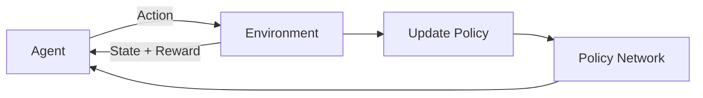

# Chapter 3: Reinforcement Learning and Sim-to-Real

---

## Introduction

**Reinforcement Learning (RL)** enables robots to learn complex behaviors through trial and error. Combined with simulation, RL allows training policies in millions of scenarios before deploying to real hardware. This chapter covers RL training in Isaac Sim and techniques for bridging the sim-to-real gap.

---

## Reinforcement Learning Basics

### Key Concepts

**Agent**: The robot or AI system making decisions

**Environment**: The world the agent interacts with

**State (s)**: Current situation (sensor readings, position, etc.)

**Action (a)**: Decision made by agent (move forward, turn, grasp)

**Reward (r)**: Feedback signal indicating success/failure

**Policy (π)**: Strategy mapping states to actions



### RL Algorithms

**Value-Based**:
* **DQN** (Deep Q-Network): Discrete actions
* **Double DQN**: Reduced overestimation

**Policy-Based**:
* **REINFORCE**: Direct policy optimization
* **PPO** (Proximal Policy Optimization): Stable, sample-efficient

**Actor-Critic**:
* **A3C** (Asynchronous Actor-Critic)
* **SAC** (Soft Actor-Critic): Continuous actions

---

## Isaac Gym

**Isaac Gym** is NVIDIA's GPU-accelerated RL training framework. It enables:

* **Thousands of parallel environments** on a single GPU
* **Direct tensor operations** (no CPU bottleneck)
* **Fast simulation** (10,000+ FPS per environment)

### Key Features

* PhysX-based physics simulation
* GPU tensor pipeline
* Support for PyTorch and TensorFlow
* Pre-built RL algorithms

### Installation

```bash
# Download Isaac Gym from NVIDIA
# https://developer.nvidia.com/isaac-gym

# Extract
tar -xf Isaac_Gym_Preview_4_Package.tar.gz
cd isaacgym/python

# Install
pip install -e .

# Test installation
cd examples
python joint_monkey.py
```

---

## Training Your First Policy

### Example: Cart-Pole Balancing

**Environment Setup**:

```python
from isaacgym import gymapi
from isaacgym import gymutil
import torch

# Create gym
gym = gymapi.acquire_gym()

# Configure simulation
sim_params = gymapi.SimParams()
sim_params.dt = 1.0 / 60.0
sim_params.substeps = 2
sim_params.up_axis = gymapi.UP_AXIS_Z
sim_params.gravity = gymapi.Vec3(0.0, 0.0, -9.81)

# PhysX parameters
sim_params.physx.num_position_iterations = 4
sim_params.physx.num_velocity_iterations = 1
sim_params.physx.rest_offset = 0.001
sim_params.physx.contact_offset = 0.02
sim_params.physx.use_gpu = True

# Create sim
sim = gym.create_sim(0, 0, gymapi.SIM_PHYSX, sim_params)
```

**Create Environments**:

```python
num_envs = 2048
envs_per_row = int(np.sqrt(num_envs))
env_spacing = 2.0

env_lower = gymapi.Vec3(-env_spacing, -env_spacing, 0.0)
env_upper = gymapi.Vec3(env_spacing, env_spacing, env_spacing)

envs = []
actor_handles = []

for i in range(num_envs):
    # Create environment
    env = gym.create_env(sim, env_lower, env_upper, envs_per_row)
    envs.append(env)
    
    # Load asset
    asset_file = "urdf/cartpole.urdf"
    asset = gym.load_asset(sim, "", asset_file)
    
    # Create actor
    pose = gymapi.Transform()
    pose.p = gymapi.Vec3(0.0, 0.0, 2.0)
    actor_handle = gym.create_actor(env, asset, pose, "cartpole", i, 1)
    actor_handles.append(actor_handle)

# Prepare simulation
gym.prepare_sim(sim)
```

**Training Loop**:

```python
import torch.nn as nn
import torch.optim as optim

class PolicyNetwork(nn.Module):
    def __init__(self, state_dim, action_dim):
        super().__init__()
        self.network = nn.Sequential(
            nn.Linear(state_dim, 256),
            nn.ReLU(),
            nn.Linear(256, 256),
            nn.ReLU(),
            nn.Linear(256, action_dim)
        )
    
    def forward(self, x):
        return self.network(x)

# Initialize policy
policy = PolicyNetwork(state_dim=4, action_dim=1).cuda()
optimizer = optim.Adam(policy.parameters(), lr=3e-4)

# Training loop
for epoch in range(1000):
    # Step simulation
    gym.simulate(sim)
    gym.fetch_results(sim, True)
    
    # Get states
    dof_states = gym.acquire_dof_state_tensor(sim)
    states = gymtorch.wrap_tensor(dof_states)
    
    # Compute actions
    with torch.no_grad():
        actions = policy(states)
    
    # Apply actions
    gym.set_dof_actuation_force_tensor(sim, gymtorch.unwrap_tensor(actions))
    
    # Compute rewards
    rewards = compute_rewards(states)
    
    # Update policy (PPO update)
    loss = ppo_update(policy, states, actions, rewards)
    
    if epoch % 100 == 0:
        print(f"Epoch {epoch}, Loss: {loss:.4f}, Mean Reward: {rewards.mean():.2f}")
```

---

## Humanoid Locomotion

### Training Bipedal Walking

**Reward Function**:

```python
def compute_humanoid_rewards(root_states, dof_pos, dof_vel, actions):
    # Forward velocity reward
    forward_vel = root_states[:, 7]  # Linear velocity X
    forward_reward = torch.clamp(forward_vel, 0, 2.0)
    
    # Upright orientation reward
    up_vec = quat_rotate(root_states[:, 3:7], torch.tensor([0, 0, 1]))
    upright_reward = torch.exp(-10 * (1 - up_vec[:, 2]))
    
    # Energy penalty
    energy_penalty = -0.01 * torch.sum(torch.square(actions), dim=-1)
    
    # Joint limit penalty
    joint_limit_penalty = -torch.sum(
        torch.clamp(torch.abs(dof_pos) - joint_limits, 0, float('inf')),
        dim=-1
    )
    
    # Total reward
    total_reward = (
        forward_reward * 1.0 +
        upright_reward * 0.5 +
        energy_penalty +
        joint_limit_penalty * 0.1
    )
    
    return total_reward
```

**Training Configuration**:

```yaml
task:
  name: Humanoid
  physics_engine: physx
  num_envs: 4096
  env_spacing: 5.0
  episode_length: 1000
  
  sim:
    dt: 0.0083  # 120 Hz
    substeps: 2
    up_axis: "z"
    use_gpu_pipeline: True
    
  env:
    num_observations: 76
    num_actions: 21
    control_freq_inv: 2
    
train:
  algorithm: ppo
  num_steps_per_env: 24
  max_iterations: 10000
  learning_rate: 3e-4
  gamma: 0.99
  lam: 0.95
  clip_param: 0.2
  entropy_coef: 0.0
  value_loss_coef: 2.0
  normalize_advantage: True
```

---

## Domain Randomization

**Domain Randomization** improves sim-to-real transfer by training on diverse environments.

### Randomization Strategies

**Visual Randomization**:
* Lighting conditions
* Texture patterns
* Camera parameters
* Background scenes

**Physical Randomization**:
* Object masses
* Friction coefficients
* Motor strengths
* Joint damping
* Ground compliance

### Implementation

```python
class DomainRandomizer:
    def __init__(self, gym, sim, envs):
        self.gym = gym
        self.sim = sim
        self.envs = envs
    
    def randomize(self):
        for i, env in enumerate(self.envs):
            # Randomize mass
            actor_handle = self.gym.get_actor_handle(env, 0)
            props = self.gym.get_actor_rigid_body_properties(env, actor_handle)
            
            for prop in props:
                mass_scale = np.random.uniform(0.8, 1.2)
                prop.mass *= mass_scale
            
            self.gym.set_actor_rigid_body_properties(env, actor_handle, props)
            
            # Randomize friction
            num_bodies = self.gym.get_actor_rigid_body_count(env, actor_handle)
            for body_idx in range(num_bodies):
                shape_props = self.gym.get_actor_rigid_shape_properties(
                    env, actor_handle
                )
                
                for shape_prop in shape_props:
                    friction = np.random.uniform(0.5, 1.5)
                    shape_prop.friction = friction
                
                self.gym.set_actor_rigid_shape_properties(
                    env, actor_handle, shape_props
                )
            
            # Randomize lighting
            light_intensity = np.random.uniform(0.5, 1.5)
            # Apply to environment lighting
```

---

## Synthetic Data Generation

### Generating Training Datasets

```python
import omni.replicator.core as rep

# Configure randomization
def randomize_scene():
    # Randomize lighting
    with rep.trigger.on_frame(num_frames=1):
        rep.randomizer.color(
            colors=[
                (1.0, 0.0, 0.0),  # Red
                (0.0, 1.0, 0.0),  # Green
                (0.0, 0.0, 1.0),  # Blue
            ]
        )
        
        rep.randomizer.texture(
            textures=rep.utils.get_textures()
        )
        
        rep.randomizer.scatter_2d(
            surface_prims=["/World/Ground"],
            check_for_collisions=True
        )

# Setup camera
camera = rep.create.camera(position=(3, 3, 3))

# Setup render product
render_product = rep.create.render_product(camera, (640, 480))

# Writer for saving data
writer = rep.WriterRegistry.get("BasicWriter")
writer.initialize(
    output_dir="~/synthetic_data",
    rgb=True,
    bounding_box_2d_tight=True,
    semantic_segmentation=True,
    instance_segmentation=True
)

# Attach writer
writer.attach([render_product])

# Generate data
for i in range(10000):
    randomize_scene()
    rep.orchestrator.step()
    print(f"Generated image {i}")
```

---

## Sim-to-Real Transfer

### The Reality Gap

Differences between simulation and reality:

* **Physics approximations**: Friction, compliance, contact dynamics
* **Sensor noise**: Real sensors are noisy and imperfect
* **Actuator dynamics**: Delays, backlash, saturation
* **Environmental variability**: Lighting, textures, temperature

### Transfer Strategies

**1. System Identification**

Measure real robot parameters:

```python
def identify_motor_params(joint_data):
    # Fit motor model to real data
    # Estimate: inertia, damping, friction, torque constant
    
    from scipy.optimize import curve_fit
    
    def motor_model(velocity, inertia, damping, friction):
        return inertia * velocity + damping * velocity + friction
    
    params, _ = curve_fit(motor_model, velocities, torques)
    return params
```

**2. Adaptive Control**

Online adaptation to real-world conditions:

```python
class AdaptiveController:
    def __init__(self, base_policy):
        self.base_policy = base_policy
        self.adaptation_network = AdaptationNetwork()
    
    def forward(self, obs, context):
        # context: recent history of states and actions
        adaptation = self.adaptation_network(context)
        adapted_action = self.base_policy(obs) + adaptation
        return adapted_action
```

**3. Fine-tuning with Real Data**

```python
# Collect real-world demonstrations
real_data = collect_real_trajectories(robot, num_episodes=100)

# Fine-tune policy
for epoch in range(10):
    for batch in real_data:
        states, actions, rewards = batch
        loss = policy.compute_loss(states, actions, rewards)
        optimizer.zero_grad()
        loss.backward()
        optimizer.step()
```

---

## Deploying to Real Hardware

### Model Export

```python
# Export trained policy
scripted_policy = torch.jit.script(policy)
scripted_policy.save("humanoid_policy.pt")

# Optimize for inference
import torch.utils.mobile_optimizer as mobile_optimizer
optimized_policy = mobile_optimizer.optimize_for_mobile(scripted_policy)
optimized_policy._save_for_lite_interpreter("humanoid_policy_mobile.ptl")
```

### Jetson Deployment

```python
import rclpy
from rclpy.node import Node
import torch
from sensor_msgs.msg import JointState
from std_msgs.msg import Float64MultiArray

class PolicyDeploymentNode(Node):
    def __init__(self):
        super().__init__('policy_node')
        
        # Load policy
        self.policy = torch.jit.load('humanoid_policy.pt')
        self.policy.eval()
        self.policy.cuda()
        
        # ROS subscriptions
        self.joint_sub = self.create_subscription(
            JointState,
            '/joint_states',
            self.joint_callback,
            10
        )
        
        # ROS publishers
        self.cmd_pub = self.create_publisher(
            Float64MultiArray,
            '/joint_commands',
            10
        )
        
        self.timer = self.create_timer(0.01, self.control_loop)  # 100 Hz
        self.latest_state = None
    
    def joint_callback(self, msg):
        self.latest_state = torch.tensor(msg.position).cuda()
    
    def control_loop(self):
        if self.latest_state is None:
            return
        
        with torch.no_grad():
            action = self.policy(self.latest_state)
        
        cmd_msg = Float64MultiArray()
        cmd_msg.data = action.cpu().numpy().tolist()
        self.cmd_pub.publish(cmd_msg)

def main():
    rclpy.init()
    node = PolicyDeploymentNode()
    rclpy.spin(node)
```

---

## Practical Projects

### Project 3.1: Train Cart-Pole Policy

* Set up Isaac Gym environment
* Implement PPO algorithm
* Train for 1000 epochs
* Visualize learning curve

### Project 3.2: Humanoid Walking

* Use pre-built humanoid environment
* Implement reward function for forward walking
* Apply domain randomization
* Train until stable walking achieved

### Project 3.3: Sim-to-Real Transfer

* Train grasping policy in Isaac Sim
* Generate synthetic data
* Deploy to real robot arm
* Fine-tune with real demonstrations

---

## Advanced Topics

### Multi-Agent RL

```python
# Train multiple robots cooperatively
class MultiAgentEnv:
    def __init__(self, num_agents=4):
        self.num_agents = num_agents
    
    def step(self, actions):
        # actions: [num_envs, num_agents, action_dim]
        # Execute actions for all agents
        # Return observations, rewards for each agent
        pass
```

### Hierarchical RL

```python
class HierarchicalPolicy:
    def __init__(self):
        self.high_level_policy = HighLevelPolicy()  # Goals
        self.low_level_policy = LowLevelPolicy()    # Actions
    
    def forward(self, obs):
        goal = self.high_level_policy(obs)
        action = self.low_level_policy(obs, goal)
        return action
```

---

## Key Takeaways

* RL enables robots to learn complex behaviors
* Isaac Gym provides GPU-accelerated training
* Domain randomization improves transfer
* Synthetic data reduces real-world requirements
* Sim-to-real gap requires careful engineering
* Deployment to edge devices requires optimization

---

## Further Resources

* Isaac Gym Documentation: https://developer.nvidia.com/isaac-gym
* Spinning Up in Deep RL: https://spinningup.openai.com
* RL Algorithms: https://stable-baselines3.readthedocs.io
* Research Papers: arXiv.org robotics section

---

**Next Module**: [Module 4 - Vision-Language-Action →](/docs/module4/overview)