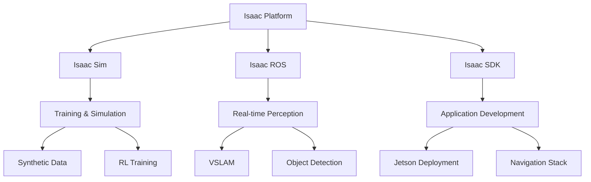
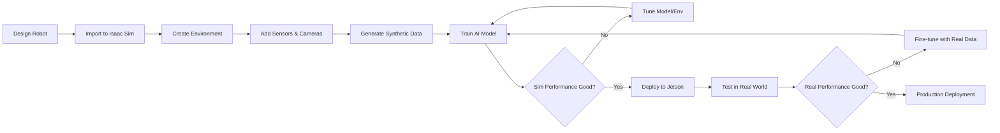

# Module 3: The AI-Robot Brain (NVIDIA Isaac™)

**Focus**: Advanced perception and training

---

## Overview

Welcome to Module 3, where simulation meets cutting-edge AI. **NVIDIA Isaac** is a complete platform for developing, training, and deploying intelligent robots. It combines photorealistic simulation, GPU-accelerated perception, and production-ready deployment tools.

Isaac transforms robots from programmed machines into learning systems that can perceive, reason, and adapt to complex environments.

---

## What is NVIDIA Isaac?

The Isaac platform consists of three main components:

### Isaac Sim

**Photorealistic robot simulator** built on NVIDIA Omniverse.

* Ray-traced rendering for realistic visuals
* PhysX 5 physics engine
* Synthetic data generation at scale
* Multi-robot simulation
* ROS 2 integration

### Isaac ROS

**Hardware-accelerated ROS 2 packages** for perception and AI.

* GPU-accelerated computer vision
* Visual SLAM (Simultaneous Localization and Mapping)
* Object detection and tracking
* Depth processing
* AI inference optimization

### Isaac SDK

**Tools and libraries** for robot application development.

* Behavior trees for robot logic
* Path planning algorithms
* Sensor fusion frameworks
* Deployment tools for Jetson devices

---

## Why NVIDIA Isaac?

### Advantages

* **GPU Acceleration**: 10-100x faster than CPU-only solutions
* **Photorealism**: Train on data indistinguishable from reality
* **Scalability**: Parallelize simulations across GPUs
* **Production Ready**: Deploy directly to Jetson edge devices
* **Ecosystem**: Integration with ROS 2, PyTorch, TensorFlow

### Industry Applications

* **Warehouses**: Autonomous material handling
* **Manufacturing**: Quality inspection and assembly
* **Healthcare**: Surgical assistance and patient care
* **Agriculture**: Crop monitoring and harvesting
* **Retail**: Inventory management and customer service

---

## Module Contents

### Chapter 1: Introduction to the NVIDIA Isaac Platform

* Isaac Sim installation and setup
* Omniverse ecosystem overview
* Creating your first Isaac simulation
* USD (Universal Scene Description) format
* Importing robots and environments

[Go to Chapter 1 →](/docs/module3/module3-chapter1)

---

### Chapter 2: AI-Powered Perception and Navigation

* Isaac ROS installation on Jetson
* Visual SLAM for localization
* Nav2 integration for path planning
* Stereo depth processing
* Object detection with DNN inference

[Go to Chapter 2 →](/docs/module3/module3-chapter2)

---

### Chapter 3: Reinforcement Learning and Sim-to-Real

* RL training in Isaac Sim
* Domain randomization techniques
* Synthetic data generation
* Sim-to-real transfer strategies
* Deploying trained models to hardware

[Go to Chapter 3 →](/docs/module3/module3-chapter3)

---

## Learning Objectives

By the end of this module, you will be able to:

* ✅ Set up and use Isaac Sim for robot simulation
* ✅ Create photorealistic training environments
* ✅ Deploy Isaac ROS on Jetson edge devices
* ✅ Implement Visual SLAM for robot navigation
* ✅ Train robots using reinforcement learning
* ✅ Generate synthetic training data at scale
* ✅ Transfer trained policies from sim to real
* ✅ Optimize AI models for edge deployment

---

## Hardware Requirements

### For Isaac Sim (Workstation)

**Minimum**:
* GPU: NVIDIA RTX 3070 (8GB VRAM)
* CPU: Intel i7 or AMD Ryzen 7
* RAM: 32 GB
* Storage: 100 GB SSD

**Recommended**:
* GPU: NVIDIA RTX 4080/4090 (16-24GB VRAM)
* CPU: Intel i9 or AMD Ryzen 9
* RAM: 64 GB
* Storage: 500 GB NVMe SSD

### For Isaac ROS (Edge Device)

**Jetson Orin Series**:
* Orin Nano (8GB): Entry-level, $249
* Orin NX (16GB): Mid-range, performance balance
* Orin AGX (64GB): Flagship, maximum performance

**Sensors**:
* Intel RealSense D435i or D455
* ZED 2/2i stereo camera (optional)
* USB or Ethernet cameras

---

## Software Requirements

* **Operating System**: Ubuntu 22.04 LTS
* **Isaac Sim**: 2023.1.1 or later
* **ROS 2**: Humble Hawksbill
* **CUDA**: 12.0 or later
* **Docker**: For containerized deployment
* **Omniverse Launcher**: Isaac Sim distribution platform

---

## Isaac Sim vs Other Simulators

| Feature | Isaac Sim | Gazebo | Unity |
|---------|-----------|--------|-------|
| **Rendering** | Ray-tracing | Rasterization | Rasterization/RT |
| **Physics** | PhysX 5 | ODE/Bullet/DART | PhysX |
| **GPU Acceleration** | Full | Partial | Partial |
| **Synthetic Data** | Native | Limited | Custom |
| **RL Training** | Built-in | External | External |
| **Multi-robot** | Yes | Yes | Yes |
| **ROS 2 Support** | Native | Native | Via bridge |
| **Cost** | Free | Free | Free/Paid |

---

## The Isaac Workflow

---

## Hands-On Projects

This module includes practical projects:

* **Project 1**: Set up Isaac Sim and simulate a mobile robot
* **Project 2**: Implement Visual SLAM on Jetson with RealSense
* **Project 3**: Train a navigation policy with reinforcement learning
* **Project 4**: Generate 10,000 synthetic images for object detection
* **Final Project**: Complete sim-to-real deployment of autonomous humanoid

---

## Assessment

* Isaac Sim environment creation (20%)
* Isaac ROS perception pipeline (25%)
* RL training and evaluation (25%)
* Sim-to-real deployment project (30%)

---

## Key Technologies

### Omniverse Platform

* **USD**: Universal Scene Description format
* **RTX**: Real-time ray tracing
* **PhysX 5**: High-fidelity physics simulation
* **MDL**: Material Definition Language

### Isaac Gym

* GPU-accelerated RL training
* Thousands of parallel environments
* Direct tensor operations (no CPU bottleneck)

### Isaac ROS GEMs

Pre-built accelerated packages:
* `isaac_ros_visual_slam`
* `isaac_ros_dnn_inference`
* `isaac_ros_image_proc`
* `isaac_ros_apriltag`
* `isaac_ros_depth_segmentation`

---

## Prerequisites

* Completion of Module 1 (ROS 2 fundamentals)
* Completion of Module 2 (Simulation basics)
* Understanding of computer vision concepts
* Basic knowledge of machine learning
* Python programming proficiency

---

## Community & Support

* **NVIDIA Developer Forums**: https://forums.developer.nvidia.com
* **Isaac Sim Documentation**: https://docs.omniverse.nvidia.com/isaacsim/latest
* **Isaac ROS Documentation**: https://nvidia-isaac-ros.github.io
* **GitHub**: https://github.com/NVIDIA-ISAAC-ROS

---

**Ready to build intelligent robots? Let's dive into Isaac!** 🚀🤖