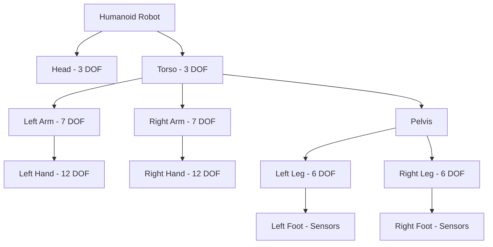

# Chapter 1: Humanoid Development and Control

---

## Introduction

Humanoid robots represent the pinnacle of robotic complexity. With bipedal locomotion, dexterous manipulation, and human-like proportions, they're designed to operate in environments built for humans. This chapter covers the fundamentals of humanoid kinematics, balance control, and full-body motion planning.

---

## Humanoid Robot Anatomy

### Key Components

**Upper Body**:
* Head (sensors, cameras)
* Torso (compute, batteries)
* Arms (7-DOF each)
* Hands (multi-finger grippers)

**Lower Body**:
* Pelvis (IMU, center of mass)
* Legs (6-DOF each)
* Feet (force/torque sensors)

### Degrees of Freedom

Typical humanoid: **30-40 DOF total**

* Head: 2-3 DOF (pan, tilt, roll)
* Each arm: 7 DOF (shoulder 3, elbow 1, wrist 3)
* Each hand: 6-12 DOF (finger joints)
* Torso: 3 DOF (roll, pitch, yaw)
* Each leg: 6 DOF (hip 3, knee 1, ankle 2)



---

## Bipedal Locomotion

### Challenges of Walking

Unlike wheeled robots, bipedal walking requires:

* **Dynamic balance**: Constantly falling and catching
* **Discrete footfalls**: Contact switches between steps
* **High-dimensional control**: Coordinating many joints
* **Under-actuation**: Cannot control all DOF simultaneously

### Zero Moment Point (ZMP)

**ZMP** is the point where the total ground reaction force acts. For stable walking, ZMP must stay inside the support polygon.

**Support Polygon**: Convex hull of ground contact points

```python
def compute_zmp(robot_state, mass_distribution):
    """
    Compute Zero Moment Point for stability
    """
    total_force = 0
    total_moment = 0
    
    for link in robot_state.links:
        mass = mass_distribution[link.id]
        gravity_force = mass * 9.81
        
        total_force += gravity_force
        total_moment += np.cross(link.position, gravity_force)
    
    zmp = total_moment / total_force
    return zmp

def is_stable(zmp, support_polygon):
    """
    Check if ZMP is inside support polygon
    """
    return point_in_polygon(zmp, support_polygon)
```

### Gait Patterns

**Walking Cycle**:
1. **Double Support**: Both feet on ground
2. **Single Support**: One foot on ground
3. **Swing Phase**: Moving foot forward
4. **Heel Strike**: Foot lands
5. Repeat

```python
class WalkingController:
    def __init__(self):
        self.phase = 0.0  # 0 to 1
        self.step_length = 0.3  # meters
        self.step_height = 0.05  # meters
        self.step_frequency = 1.0  # Hz
    
    def compute_foot_trajectory(self, t):
        # Swing foot trajectory (cycloid)
        if self.phase < 0.5:  # Swing phase
            s = self.phase * 2  # 0 to 1
            x = self.step_length * s
            z = self.step_height * (1 - np.cos(2 * np.pi * s)) / 2
        else:  # Support phase
            x = self.step_length
            z = 0.0
        
        return np.array([x, 0, z])
    
    def update(self, dt):
        self.phase += dt * self.step_frequency
        if self.phase >= 1.0:
            self.phase -= 1.0
```

---

## Balance Control

### Center of Mass (CoM) Tracking

```python
class BalanceController:
    def __init__(self):
        self.kp = 100.0  # Position gain
        self.kd = 20.0   # Velocity gain
    
    def compute_ankle_torque(self, com_error, com_velocity):
        """
        PD controller for ankle torque to maintain balance
        """
        torque = (
            self.kp * com_error +
            self.kd * com_velocity
        )
        return np.clip(torque, -50.0, 50.0)  # Torque limits
    
    def compute_com(self, robot_state):
        """
        Calculate center of mass from robot state
        """
        total_mass = 0
        weighted_position = np.zeros(3)
        
        for link in robot_state.links:
            total_mass += link.mass
            weighted_position += link.mass * link.position
        
        com = weighted_position / total_mass
        return com
```

### Model Predictive Control (MPC)

```python
import cvxpy as cp

class MPCBalanceController:
    def __init__(self, horizon=10):
        self.horizon = horizon
        self.dt = 0.01
    
    def solve(self, current_state, target_com):
        # State: [x, dx, ddx]
        # Control: foot forces
        
        x = cp.Variable((3, self.horizon))
        u = cp.Variable((2, self.horizon - 1))
        
        # Dynamics: x[k+1] = A*x[k] + B*u[k]
        A = np.array([[1, self.dt, 0.5*self.dt**2],
                      [0, 1, self.dt],
                      [0, 0, 0]])
        B = np.array([[0], [0], [1]])
        
        # Cost function
        Q = np.diag([100, 10, 1])  # State cost
        R = np.diag([0.01])        # Control cost
        
        cost = 0
        constraints = [x[:, 0] == current_state]
        
        for k in range(self.horizon - 1):
            cost += cp.quad_form(x[:, k] - target_com, Q)
            cost += cp.quad_form(u[:, k], R)
            constraints += [x[:, k+1] == A @ x[:, k] + B @ u[:, k]]
        
        problem = cp.Problem(cp.Minimize(cost), constraints)
        problem.solve()
        
        return u.value[:, 0]
```

---

## Inverse Kinematics

**IK** computes joint angles to achieve desired end-effector positions.

### Analytical IK (Simple Arm)

```python
def inverse_kinematics_2dof(target_x, target_y, l1, l2):
    """
    IK for 2-DOF planar arm
    l1, l2: link lengths
    """
    # Distance to target
    d = np.sqrt(target_x**2 + target_y**2)
    
    # Check if reachable
    if d > l1 + l2 or d < abs(l1 - l2):
        return None
    
    # Law of cosines
    cos_theta2 = (d**2 - l1**2 - l2**2) / (2 * l1 * l2)
    theta2 = np.arccos(np.clip(cos_theta2, -1, 1))
    
    # Solve for theta1
    k1 = l1 + l2 * np.cos(theta2)
    k2 = l2 * np.sin(theta2)
    theta1 = np.arctan2(target_y, target_x) - np.arctan2(k2, k1)
    
    return np.array([theta1, theta2])
```

### Numerical IK (General)

```python
def inverse_kinematics_numerical(robot, target_pose, max_iterations=100):
    """
    Iterative IK using Jacobian pseudo-inverse
    """
    current_joints = robot.get_joint_positions()
    
    for i in range(max_iterations):
        # Forward kinematics
        current_pose = robot.forward_kinematics(current_joints)
        
        # Error
        position_error = target_pose[:3] - current_pose[:3]
        orientation_error = orientation_difference(
            target_pose[3:], current_pose[3:]
        )
        error = np.concatenate([position_error, orientation_error])
        
        # Check convergence
        if np.linalg.norm(error) < 0.001:
            return current_joints
        
        # Jacobian
        J = robot.compute_jacobian(current_joints)
        
        # Pseudo-inverse solution
        delta_q = np.linalg.pinv(J) @ error
        
        # Update
        current_joints += 0.1 * delta_q  # Step size
    
    return current_joints
```

---

## Manipulation with Humanoid Hands

### Grasp Planning

```python
class GraspPlanner:
    def __init__(self):
        self.grasp_types = {
            'power': self.power_grasp,
            'precision': self.precision_grasp,
            'pinch': self.pinch_grasp
        }
    
    def plan_grasp(self, object_shape, object_size):
        """
        Select appropriate grasp based on object properties
        """
        if object_size > 0.1:  # Large object
            return self.grasp_types['power']
        elif object_size < 0.03:  # Small object
            return self.grasp_types['pinch']
        else:
            return self.grasp_types['precision']
    
    def power_grasp(self, hand, object_pose):
        """
        Whole-hand power grasp
        """
        finger_positions = {
            'thumb': [0.8, 0.8, 0.8],
            'index': [0.8, 0.8, 0.8],
            'middle': [0.8, 0.8, 0.8],
            'ring': [0.8, 0.8, 0.8],
            'pinky': [0.8, 0.8, 0.8]
        }
        return finger_positions
    
    def precision_grasp(self, hand, object_pose):
        """
        Fingertip precision grasp
        """
        finger_positions = {
            'thumb': [0.5, 0.3, 0.3],
            'index': [0.5, 0.3, 0.3],
            'middle': [0.3, 0.2, 0.2],
            'ring': [0.0, 0.0, 0.0],
            'pinky': [0.0, 0.0, 0.0]
        }
        return finger_positions
```

### Force Control

```python
class ForceController:
    def __init__(self):
        self.target_force = 5.0  # Newtons
        self.kp = 0.1
    
    def control(self, measured_force):
        """
        Adjust finger position based on force feedback
        """
        force_error = self.target_force - measured_force
        position_adjustment = self.kp * force_error
        return position_adjustment
```

---

## Full-Body Motion Planning

### Whole-Body Controller

```python
class WholeBodyController:
    def __init__(self, robot):
        self.robot = robot
        self.num_joints = robot.get_num_joints()
    
    def solve_qp(self, tasks, constraints):
        """
        Quadratic Programming for whole-body control
        Tasks: [(jacobian, desired_acceleration, weight), ...]
        """
        import cvxpy as cp
        
        # Decision variable: joint accelerations
        ddq = cp.Variable(self.num_joints)
        
        # Cost: weighted task errors
        cost = 0
        for J, ddx_desired, weight in tasks:
            task_error = J @ ddq - ddx_desired
            cost += weight * cp.sum_squares(task_error)
        
        # Constraints
        constraints_list = []
        for constraint in constraints:
            # Joint limits, torque limits, contact forces
            constraints_list.append(constraint(ddq))
        
        problem = cp.Problem(cp.Minimize(cost), constraints_list)
        problem.solve()
        
        return ddq.value
    
    def step(self, tasks):
        """
        Execute one control step
        """
        # Example tasks
        # 1. CoM tracking (high priority)
        # 2. Swing foot trajectory (high priority)
        # 3. Upper body posture (medium priority)
        # 4. Joint regularization (low priority)
        
        ddq = self.solve_qp(tasks, self.robot.get_constraints())
        
        # Integrate to get velocities and positions
        dt = 0.001
        dq = self.robot.get_joint_velocities()
        q = self.robot.get_joint_positions()
        
        dq_new = dq + ddq * dt
        q_new = q + dq_new * dt
        
        self.robot.set_joint_positions(q_new)
```

---

## Natural Human-Robot Interaction

### Gesture Recognition

```python
import cv2
import mediapipe as mp

class GestureRecognizer:
    def __init__(self):
        self.mp_hands = mp.solutions.hands
        self.hands = self.mp_hands.Hands()
    
    def detect_gesture(self, image):
        """
        Detect hand gestures from camera
        """
        results = self.hands.process(cv2.cvtColor(image, cv2.COLOR_BGR2RGB))
        
        if not results.multi_hand_landmarks:
            return "no_hand"
        
        landmarks = results.multi_hand_landmarks[0]
        
        # Simple gesture classification
        if self.is_thumbs_up(landmarks):
            return "thumbs_up"
        elif self.is_pointing(landmarks):
            return "pointing"
        elif self.is_open_palm(landmarks):
            return "stop"
        
        return "unknown"
    
    def is_thumbs_up(self, landmarks):
        thumb_tip = landmarks.landmark[4]
        thumb_ip = landmarks.landmark[3]
        return thumb_tip.y < thumb_ip.y  # Simplified
```

### Proxemics (Personal Space)

```python
class ProxemicsController:
    def __init__(self):
        self.intimate_distance = 0.5  # meters
        self.personal_distance = 1.2
        self.social_distance = 3.6
    
    def adjust_distance(self, human_position, robot_position):
        """
        Maintain appropriate distance from humans
        """
        distance = np.linalg.norm(human_position - robot_position)
        
        if distance < self.intimate_distance:
            # Too close, back away
            direction = robot_position - human_position
            direction = direction / np.linalg.norm(direction)
            target = human_position + direction * self.personal_distance
            return target
        
        return robot_position  # Distance OK
```

---

## Practical Projects

### Project 1.1: Walking Controller

* Implement ZMP-based walking
* Test in Isaac Sim with humanoid model
* Tune parameters for stable walking
* Add obstacle avoidance

### Project 1.2: Bi-Manual Manipulation

* Program humanoid to pick up box with both hands
* Implement coordinated arm motion
* Test with various object sizes
* Add force feedback

### Project 1.3: Full-Body Task

* Command humanoid to: walk forward, pick up object, carry it, place it
* Integrate locomotion + manipulation
* Handle transitions between tasks

---

## Debugging Tips

* **Robot falls**: Check ZMP, increase foot friction
* **Jittery motion**: Reduce controller gains, add filtering
* **Joints exceed limits**: Add joint limit constraints in QP
* **Slow performance**: Use GPU acceleration, reduce solver iterations

---

## Key Takeaways

* Humanoid control requires balancing many constraints
* ZMP is critical for bipedal stability
* Inverse kinematics enables task-space control
* Whole-body QP coordinates multiple objectives
* Natural interaction requires understanding human behavior

---

## Further Resources

* "Humanoid Robotics: A Reference" - Goswami & Vadakkepat
* "Robotics: Modelling, Planning and Control" - Siciliano et al.
* MIT Humanoid Robotics Course: https://humanoids.mit.edu
* Dynamic Walking Conference: https://www.dynamic-walking.org

---

**Next**: [Chapter 2 - Conversational Robotics with LLMs →](/docs/module4/chapter2)