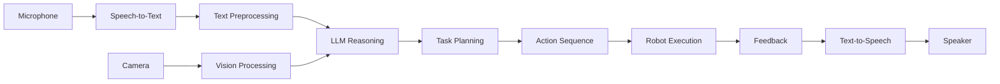

# Chapter 2: Conversational Robotics with LLMs

---

## Introduction

**Conversational robotics** enables natural human-robot interaction through spoken language. By integrating speech recognition, large language models (LLMs), and robot control, we create systems that understand intent and execute complex tasks from simple voice commands.

This chapter covers the complete pipeline: voice → understanding → planning → action.

---

## The VLA Pipeline



---

## Speech Recognition with Whisper

**OpenAI Whisper** is a state-of-the-art speech-to-text model that's:

* Multilingual (99 languages)
* Robust to accents and noise
* Open-source
* Runs on edge devices

### Installing Whisper

```bash
# Install Whisper
pip install openai-whisper

# Install additional dependencies
pip install pyaudio sounddevice
```

### Basic Speech Recognition

```python
import whisper
import sounddevice as sd
import numpy as np
from scipy.io.wavfile import write

class SpeechRecognizer:
    def __init__(self, model_size='base'):
        """
        model_size: tiny, base, small, medium, large
        Trade-off: accuracy vs. speed
        """
        print(f"Loading Whisper {model_size} model...")
        self.model = whisper.load_model(model_size)
        self.sample_rate = 16000
    
    def record_audio(self, duration=5):
        """
        Record audio from microphone
        """
        print("Recording...")
        audio = sd.rec(
            int(duration * self.sample_rate),
            samplerate=self.sample_rate,
            channels=1,
            dtype='float32'
        )
        sd.wait()
        print("Recording complete")
        return audio.flatten()
    
    def transcribe(self, audio):
        """
        Convert audio to text
        """
        result = self.model.transcribe(audio, fp16=False)
        return result['text']
    
    def listen(self, duration=5):
        """
        Complete listen → transcribe pipeline
        """
        audio = self.record_audio(duration)
        text = self.transcribe(audio)
        return text

# Usage
recognizer = SpeechRecognizer(model_size='base')
command = recognizer.listen(duration=5)
print(f"You said: {command}")
```

### Real-Time Recognition

```python
import queue
import threading

class RealtimeSpeechRecognizer:
    def __init__(self):
        self.model = whisper.load_model('base')
        self.audio_queue = queue.Queue()
        self.running = False
    
    def audio_callback(self, indata, frames, time, status):
        """Callback for continuous audio stream"""
        self.audio_queue.put(indata.copy())
    
    def start_listening(self):
        """Start continuous audio capture"""
        self.running = True
        self.stream = sd.InputStream(
            callback=self.audio_callback,
            channels=1,
            samplerate=16000
        )
        self.stream.start()
        
        # Start processing thread
        self.process_thread = threading.Thread(target=self.process_audio)
        self.process_thread.start()
    
    def process_audio(self):
        """Process audio chunks"""
        buffer = []
        chunk_duration = 3.0  # seconds
        chunks_needed = int(chunk_duration * 16000 / 1024)
        
        while self.running:
            if not self.audio_queue.empty():
                chunk = self.audio_queue.get()
                buffer.append(chunk)
                
                if len(buffer) >= chunks_needed:
                    audio = np.concatenate(buffer).flatten()
                    text = self.model.transcribe(audio, fp16=False)['text']
                    
                    if text.strip():
                        print(f"Transcribed: {text}")
                        self.on_command(text)
                    
                    buffer = []
    
    def on_command(self, text):
        """Override this method to handle commands"""
        pass
    
    def stop_listening(self):
        """Stop audio capture"""
        self.running = False
        self.stream.stop()
        self.process_thread.join()
```

---

## Integrating LLMs

### Using GPT-4 via OpenAI API

```python
from openai import OpenAI
import json

class RobotLLMPlanner:
    def __init__(self, api_key):
        self.client = OpenAI(api_key=api_key)
        self.robot_capabilities = [
            "navigate_to(location)",
            "pick_up(object)",
            "place(object, location)",
            "open(container)",
            "close(container)",
            "wait(seconds)"
        ]
    
    def create_system_prompt(self):
        return f"""You are a helpful robot assistant. You can perform these actions:
{chr(10).join('- ' + cap for cap in self.robot_capabilities)}

When given a command, break it down into a sequence of these actions.
Return your response as a JSON array of action objects.

Example:
User: "Get me a drink from the fridge"
Response: [
    {{"action": "navigate_to", "params": {{"location": "kitchen"}}}},
    {{"action": "open", "params": {{"container": "fridge"}}}},
    {{"action": "pick_up", "params": {{"object": "drink"}}}},
    {{"action": "close", "params": {{"container": "fridge"}}}},
    {{"action": "navigate_to", "params": {{"location": "user"}}}},
    {{"action": "place", "params": {{"object": "drink", "location": "table"}}}}
]
"""
    
    def plan_actions(self, user_command, context=None):
        """
        Convert natural language to action sequence
        """
        messages = [
            {"role": "system", "content": self.create_system_prompt()}
        ]
        
        if context:
            messages.append({
                "role": "system",
                "content": f"Current robot state: {json.dumps(context)}"
            })
        
        messages.append({
            "role": "user",
            "content": user_command
        })
        
        response = self.client.chat.completions.create(
            model="gpt-4",
            messages=messages,
            temperature=0.3
        )
        
        # Parse response
        try:
            action_sequence = json.loads(response.choices[0].message.content)
            return action_sequence
        except json.JSONDecodeError:
            print("Failed to parse LLM response")
            return []

# Usage
planner = RobotLLMPlanner(api_key="your-api-key")
actions = planner.plan_actions("Clean up the living room")
print(actions)
```

### Using Local LLMs (LLaMA)

```python
from transformers import AutoTokenizer, AutoModelForCausalLM
import torch

class LocalLLMPlanner:
    def __init__(self, model_name="meta-llama/Llama-2-7b-chat-hf"):
        print("Loading model...")
        self.tokenizer = AutoTokenizer.from_pretrained(model_name)
        self.model = AutoModelForCausalLM.from_pretrained(
            model_name,
            torch_dtype=torch.float16,
            device_map="auto"
        )
    
    def generate_plan(self, prompt, max_length=512):
        inputs = self.tokenizer(prompt, return_tensors="pt").to("cuda")
        
        with torch.no_grad():
            outputs = self.model.generate(
                **inputs,
                max_length=max_length,
                temperature=0.7,
                do_sample=True
            )
        
        response = self.tokenizer.decode(outputs[0], skip_special_tokens=True)
        return response
```

---

## ROS 2 Integration

### Speech Command Node

```python
import rclpy
from rclpy.node import Node
from std_msgs.msg import String
from robot_interfaces.msg import ActionSequence, RobotAction

class SpeechCommandNode(Node):
    def __init__(self):
        super().__init__('speech_command_node')
        
        # Publishers
        self.action_pub = self.create_publisher(
            ActionSequence,
            '/robot/action_sequence',
            10
        )
        
        self.status_pub = self.create_publisher(
            String,
            '/robot/status',
            10
        )
        
        # Speech recognizer
        self.recognizer = SpeechRecognizer(model_size='base')
        
        # LLM planner
        self.planner = RobotLLMPlanner(api_key=self.get_parameter('openai_key').value)
        
        # Timer for listening
        self.timer = self.create_timer(0.1, self.listen_callback)
        self.is_listening = False
    
    def listen_callback(self):
        if not self.is_listening:
            self.get_logger().info("Listening for command...")
            self.is_listening = True
            
            try:
                # Listen for voice command
                command = self.recognizer.listen(duration=5)
                self.get_logger().info(f"Heard: {command}")
                
                # Plan actions
                actions = self.planner.plan_actions(command)
                
                # Publish action sequence
                msg = self.create_action_sequence_msg(actions)
                self.action_pub.publish(msg)
                
                # Publish status
                status_msg = String()
                status_msg.data = f"Executing: {command}"
                self.status_pub.publish(status_msg)
                
            except Exception as e:
                self.get_logger().error(f"Error: {e}")
            
            finally:
                self.is_listening = False
    
    def create_action_sequence_msg(self, actions):
        msg = ActionSequence()
        
        for action_dict in actions:
            action = RobotAction()
            action.action_type = action_dict['action']
            action.parameters = json.dumps(action_dict.get('params', {}))
            msg.actions.append(action)
        
        return msg

def main():
    rclpy.init()
    node = SpeechCommandNode()
    rclpy.spin(node)
    rclpy.shutdown()
```

---

## Vision-Language Integration

### Describing Visual Scenes

```python
from transformers import BlipProcessor, BlipForConditionalGeneration
from PIL import Image

class VisionLanguageModel:
    def __init__(self):
        self.processor = BlipProcessor.from_pretrained(
            "Salesforce/blip-image-captioning-base"
        )
        self.model = BlipForConditionalGeneration.from_pretrained(
            "Salesforce/blip-image-captioning-base"
        ).to("cuda")
    
    def describe_image(self, image):
        """
        Generate natural language description of image
        """
        inputs = self.processor(image, return_tensors="pt").to("cuda")
        
        outputs = self.model.generate(**inputs)
        caption = self.processor.decode(outputs[0], skip_special_tokens=True)
        
        return caption
    
    def answer_question(self, image, question):
        """
        Visual question answering
        """
        inputs = self.processor(image, question, return_tensors="pt").to("cuda")
        
        outputs = self.model.generate(**inputs)
        answer = self.processor.decode(outputs[0], skip_special_tokens=True)
        
        return answer

# Usage with ROS
class VisionLanguageNode(Node):
    def __init__(self):
        super().__init__('vision_language_node')
        
        self.vlm = VisionLanguageModel()
        
        self.image_sub = self.create_subscription(
            Image,
            '/camera/image_raw',
            self.image_callback,
            10
        )
        
        self.description_pub = self.create_publisher(
            String,
            '/scene_description',
            10
        )
    
    def image_callback(self, msg):
        # Convert ROS Image to PIL Image
        image = self.ros_to_pil(msg)
        
        # Generate description
        description = self.vlm.describe_image(image)
        
        # Publish
        desc_msg = String()
        desc_msg.data = description
        self.description_pub.publish(desc_msg)
```

---

## Multi-Modal Reasoning

### Combining Speech, Vision, and Robot State

```python
class MultiModalReasoner:
    def __init__(self):
        self.llm = RobotLLMPlanner(api_key="your-key")
        self.vlm = VisionLanguageModel()
    
    def reason(self, voice_command, camera_image, robot_state):
        """
        Multi-modal reasoning
        """
        # Get visual scene description
        scene_description = self.vlm.describe_image(camera_image)
        
        # Create context for LLM
        context = {
            "scene": scene_description,
            "robot_position": robot_state['position'],
            "robot_battery": robot_state['battery'],
            "objects_detected": robot_state.get('objects', [])
        }
        
        # Enhanced prompt
        prompt = f"""
        User command: {voice_command}
        
        Visual scene: {scene_description}
        
        Robot status:
        - Position: {robot_state['position']}
        - Battery: {robot_state['battery']}%
        - Detected objects: {', '.join(robot_state.get('objects', []))}
        
        Plan a sequence of actions considering the current scene and robot state.
        """
        
        actions = self.llm.plan_actions(prompt)
        return actions
```

---

## Text-to-Speech (TTS)

### Robot Voice Response

```python
import pyttsx3

class RobotVoice:
    def __init__(self):
        self.engine = pyttsx3.init()
        
        # Configure voice
        voices = self.engine.getProperty('voices')
        self.engine.setProperty('voice', voices[0].id)  # Male voice
        self.engine.setProperty('rate', 150)  # Speed
        self.engine.setProperty('volume', 0.9)  # Volume
    
    def speak(self, text):
        """
        Convert text to speech
        """
        self.engine.say(text)
        self.engine.runAndWait()
    
    def speak_async(self, text):
        """
        Non-blocking speech
        """
        import threading
        thread = threading.Thread(target=self.speak, args=(text,))
        thread.start()

# Usage
voice = RobotVoice()
voice.speak("Hello, I am ready to assist you")
```

### Alternative: Google TTS

```python
from gtts import gTTS
import os

def speak_google(text, lang='en'):
    tts = gTTS(text=text, lang=lang, slow=False)
    tts.save("response.mp3")
    os.system("mpg321 response.mp3")  # Linux
    # os.system("afplay response.mp3")  # macOS
```

---

## Safety and Error Handling

### Command Validation

```python
class SafetyValidator:
    def __init__(self):
        self.dangerous_actions = [
            'drop',
            'throw',
            'break',
            'hit'
        ]
        
        self.restricted_locations = [
            'stairs',
            'pool',
            'street'
        ]
    
    def validate_command(self, command):
        """
        Check if command is safe
        """
        command_lower = command.lower()
        
        # Check for dangerous actions
        for action in self.dangerous_actions:
            if action in command_lower:
                return False, f"Cannot perform dangerous action: {action}"
        
        # Check for restricted locations
        for location in self.restricted_locations:
            if location in command_lower:
                return False, f"Cannot navigate to restricted area: {location}"
        
        return True, "Command is safe"
    
    def validate_action_sequence(self, actions):
        """
        Validate entire action sequence
        """
        for action in actions:
            # Check action feasibility
            if action['action'] == 'navigate_to':
                location = action['params'].get('location')
                if location in self.restricted_locations:
                    return False, f"Restricted location: {location}"
        
        return True, "Action sequence is safe"
```

### Confirmation Dialog

```python
class ConfirmationDialog:
    def __init__(self, voice):
        self.voice = voice
        self.recognizer = SpeechRecognizer()
    
    def confirm_action(self, action_description):
        """
        Ask user to confirm action
        """
        self.voice.speak(f"Should I {action_description}? Say yes or no.")
        
        response = self.recognizer.listen(duration=3)
        response_lower = response.lower()
        
        if 'yes' in response_lower or 'confirm' in response_lower:
            return True
        elif 'no' in response_lower or 'cancel' in response_lower:
            return False
        else:
            self.voice.speak("I didn't understand. Cancelling action.")
            return False
```

---

## Practical Projects

### Project 2.1: Voice-Controlled Robot

* Implement speech recognition with Whisper
* Create basic command parser
* Control robot with voice commands
* Add voice feedback

### Project 2.2: LLM Task Planner

* Integrate GPT-4 or local LLM
* Parse complex multi-step commands
* Generate action sequences
* Handle ambiguous commands

### Project 2.3: Multi-Modal Assistant

* Combine speech, vision, and LLM
* Describe what robot sees
* Answer questions about environment
* Execute commands based on visual context

---

## Key Takeaways

* Whisper enables robust speech recognition
* LLMs translate language to robot actions
* Multi-modal integration improves understanding
* Safety validation prevents dangerous commands
* TTS provides natural feedback
* ROS 2 integration enables real-time control

---

## Further Resources

* Whisper Documentation: https://github.com/openai/whisper
* OpenAI API: https://platform.openai.com/docs
* Hugging Face Transformers: https://huggingface.co/docs/transformers
* ROS 2 Speech Package: https://github.com/ros2/demos

---

**Next**: [Chapter 3 - Capstone Project: The Autonomous Humanoid →](/docs/module4/chapter3)