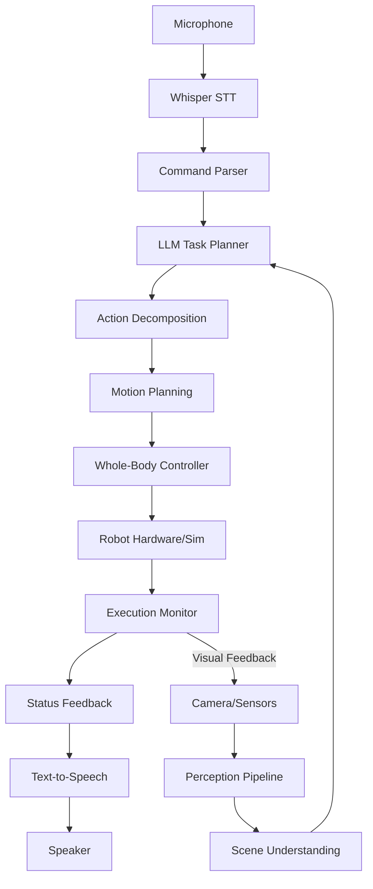

# Chapter 3: Capstone Project - The Autonomous Humanoid

---

## Introduction

This is it—the culmination of everything you've learned. Your **capstone project** is to build a complete autonomous humanoid system that receives voice commands, plans actions using an LLM, navigates environments, manipulates objects, and provides verbal feedback.

This chapter guides you through the complete system integration.

---

## Project Overview

### The Challenge

Create a humanoid robot system that can:

1. **Listen** to voice commands in natural language
2. **See** and understand its environment
3. **Plan** multi-step actions using AI
4. **Execute** tasks with full-body control
5. **Communicate** progress and results

### Example Scenario

**Command**: "Clean the living room"

**Robot Actions**:
1. Use vision to identify objects on floor
2. Navigate to first object
3. Pick up object
4. Navigate to storage location
5. Place object
6. Repeat for remaining objects
7. Verbally confirm completion

---

## System Architecture



---

## Component Integration

### 1. Speech Input Module

```python
import rclpy
from rclpy.node import Node
from std_msgs.msg import String
import whisper
import sounddevice as sd
import numpy as np

class SpeechInputNode(Node):
    def __init__(self):
        super().__init__('speech_input')
        
        # Publisher for recognized commands
        self.command_pub = self.create_publisher(
            String,
            '/voice_command',
            10
        )
        
        # Load Whisper model
        self.model = whisper.load_model('base')
        
        # Start listening
        self.timer = self.create_timer(1.0, self.listen)
        self.is_processing = False
    
    def listen(self):
        if self.is_processing:
            return
        
        self.is_processing = True
        self.get_logger().info("Listening...")
        
        try:
            # Record audio
            audio = sd.rec(
                int(5 * 16000),
                samplerate=16000,
                channels=1,
                dtype='float32'
            )
            sd.wait()
            
            # Transcribe
            result = self.model.transcribe(audio.flatten())
            command = result['text'].strip()
            
            if command:
                self.get_logger().info(f"Command: {command}")
                msg = String()
                msg.data = command
                self.command_pub.publish(msg)
        
        except Exception as e:
            self.get_logger().error(f"Speech error: {e}")
        
        finally:
            self.is_processing = False
```

### 2. Vision Perception Module

```python
from sensor_msgs.msg import Image
from vision_msgs.msg import Detection2DArray
from cv_bridge import CvBridge
import cv2

class VisionPerceptionNode(Node):
    def __init__(self):
        super().__init__('vision_perception')
        
        self.bridge = CvBridge()
        
        # Subscribers
        self.image_sub = self.create_subscription(
            Image,
            '/camera/color/image_raw',
            self.image_callback,
            10
        )
        
        self.detection_sub = self.create_subscription(
            Detection2DArray,
            '/object_detections',
            self.detection_callback,
            10
        )
        
        # Publishers
        self.scene_pub = self.create_publisher(
            String,
            '/scene_description',
            10
        )
        
        self.objects = []
    
    def image_callback(self, msg):
        image = self.bridge.imgmsg_to_cv2(msg, 'bgr8')
        # Process image
    
    def detection_callback(self, msg):
        self.objects = []
        
        for detection in msg.detections:
            if detection.results:
                class_id = detection.results[0].hypothesis.class_id
                score = detection.results[0].hypothesis.score
                
                if score > 0.5:
                    self.objects.append({
                        'class': class_id,
                        'bbox': detection.bbox,
                        'score': score
                    })
        
        # Publish scene description
        scene_desc = self.generate_scene_description()
        msg = String()
        msg.data = scene_desc
        self.scene_pub.publish(msg)
    
    def generate_scene_description(self):
        if not self.objects:
            return "No objects detected"
        
        object_counts = {}
        for obj in self.objects:
            class_name = obj['class']
            object_counts[class_name] = object_counts.get(class_name, 0) + 1
        
        desc_parts = []
        for obj_class, count in object_counts.items():
            desc_parts.append(f"{count} {obj_class}{'s' if count > 1 else ''}")
        
        return f"I see: {', '.join(desc_parts)}"
```

### 3. LLM Planning Module

```python
from robot_interfaces.msg import ActionSequence, RobotAction
from openai import OpenAI
import json

class LLMPlanningNode(Node):
    def __init__(self):
        super().__init__('llm_planning')
        
        # Parameters
        self.declare_parameter('openai_api_key', '')
        api_key = self.get_parameter('openai_api_key').value
        self.client = OpenAI(api_key=api_key)
        
        # Subscribers
        self.command_sub = self.create_subscription(
            String,
            '/voice_command',
            self.command_callback,
            10
        )
        
        self.scene_sub = self.create_subscription(
            String,
            '/scene_description',
            self.scene_callback,
            10
        )
        
        # Publisher
        self.action_pub = self.create_publisher(
            ActionSequence,
            '/planned_actions',
            10
        )
        
        self.latest_scene = "Unknown environment"
    
    def scene_callback(self, msg):
        self.latest_scene = msg.data
    
    def command_callback(self, msg):
        command = msg.data
        self.get_logger().info(f"Planning for: {command}")
        
        # Generate plan
        actions = self.plan_with_llm(command, self.latest_scene)
        
        # Publish action sequence
        action_msg = self.create_action_sequence(actions)
        self.action_pub.publish(action_msg)
    
    def plan_with_llm(self, command, scene_context):
        system_prompt = f"""You are a humanoid robot. Current scene: {scene_context}

Available actions:
- navigate_to(location): Move to a location
- pick_up(object): Grasp an object
- place(object, location): Place object at location
- scan_area(): Look around
- say(message): Speak to user

Return a JSON array of actions to execute the command."""
        
        response = self.client.chat.completions.create(
            model="gpt-4",
            messages=[
                {"role": "system", "content": system_prompt},
                {"role": "user", "content": command}
            ],
            temperature=0.3
        )
        
        try:
            actions = json.loads(response.choices[0].message.content)
            return actions
        except:
            return []
    
    def create_action_sequence(self, actions):
        msg = ActionSequence()
        for action_dict in actions:
            action = RobotAction()
            action.action_type = action_dict.get('action', '')
            action.parameters = json.dumps(action_dict.get('params', {}))
            msg.actions.append(action)
        return msg
```

### 4. Execution Controller

```python
from geometry_msgs.msg import Twist
from trajectory_msgs.msg import JointTrajectory
import json

class ExecutionControllerNode(Node):
    def __init__(self):
        super().__init__('execution_controller')
        
        # Subscriber
        self.action_sub = self.create_subscription(
            ActionSequence,
            '/planned_actions',
            self.action_callback,
            10
        )
        
        # Publishers
        self.vel_pub = self.create_publisher(
            Twist,
            '/cmd_vel',
            10
        )
        
        self.joint_pub = self.create_publisher(
            JointTrajectory,
            '/joint_trajectory',
            10
        )
        
        self.status_pub = self.create_publisher(
            String,
            '/execution_status',
            10
        )
        
        self.action_queue = []
        self.timer = self.create_timer(0.1, self.execute_next)
    
    def action_callback(self, msg):
        self.action_queue = list(msg.actions)
        self.get_logger().info(f"Received {len(self.action_queue)} actions")
    
    def execute_next(self):
        if not self.action_queue:
            return
        
        action = self.action_queue.pop(0)
        self.get_logger().info(f"Executing: {action.action_type}")
        
        params = json.loads(action.parameters)
        
        if action.action_type == 'navigate_to':
            self.navigate(params.get('location'))
        elif action.action_type == 'pick_up':
            self.pick_object(params.get('object'))
        elif action.action_type == 'place':
            self.place_object(params.get('location'))
        elif action.action_type == 'say':
            self.speak(params.get('message'))
    
    def navigate(self, location):
        # Navigation logic
        self.publish_status(f"Navigating to {location}")
        # Use Nav2 or custom navigation
    
    def pick_object(self, object_name):
        self.publish_status(f"Picking up {object_name}")
        # Use manipulation pipeline
    
    def place_object(self, location):
        self.publish_status(f"Placing object at {location}")
        # Use manipulation pipeline
    
    def speak(self, message):
        self.publish_status(f"Saying: {message}")
        # Use TTS
    
    def publish_status(self, status):
        msg = String()
        msg.data = status
        self.status_pub.publish(msg)
        self.get_logger().info(status)
```

### 5. Feedback Module

```python
import pyttsx3

class FeedbackNode(Node):
    def __init__(self):
        super().__init__('feedback_node')
        
        # Text-to-speech
        self.tts_engine = pyttsx3.init()
        self.tts_engine.setProperty('rate', 150)
        
        # Subscriber
        self.status_sub = self.create_subscription(
            String,
            '/execution_status',
            self.status_callback,
            10
        )
    
    def status_callback(self, msg):
        status = msg.data
        self.get_logger().info(f"Status: {status}")
        
        # Speak status
        self.speak(status)
    
    def speak(self, text):
        try:
            self.tts_engine.say(text)
            self.tts_engine.runAndWait()
        except Exception as e:
            self.get_logger().error(f"TTS error: {e}")
```

---

## Launch File

```python
from launch import LaunchDescription
from launch_ros.actions import Node

def generate_launch_description():
    return LaunchDescription([
        # Speech input
        Node(
            package='capstone_project',
            executable='speech_input_node',
            name='speech_input',
            output='screen'
        ),
        
        # Vision perception
        Node(
            package='capstone_project',
            executable='vision_perception_node',
            name='vision_perception',
            output='screen'
        ),
        
        # LLM planning
        Node(
            package='capstone_project',
            executable='llm_planning_node',
            name='llm_planning',
            parameters=[{'openai_api_key': 'your-key'}],
            output='screen'
        ),
        
        # Execution controller
        Node(
            package='capstone_project',
            executable='execution_controller_node',
            name='execution_controller',
            output='screen'
        ),
        
        # Feedback
        Node(
            package='capstone_project',
            executable='feedback_node',
            name='feedback',
            output='screen'
        )
    ])
```

---

## Testing Strategy

### Unit Tests

```python
import unittest

class TestSpeechInput(unittest.TestCase):
    def test_transcription(self):
        recognizer = SpeechRecognizer()
        # Test with sample audio
        text = recognizer.transcribe(sample_audio)
        self.assertIsNotNone(text)

class TestLLMPlanning(unittest.TestCase):
    def test_simple_command(self):
        planner = LLMPlanningNode()
        actions = planner.plan_with_llm(
            "Go to the kitchen",
            "Living room"
        )
        self.assertGreater(len(actions), 0)
        self.assertEqual(actions[0]['action'], 'navigate_to')
```

### Integration Tests

```python
def test_full_pipeline():
    """Test complete voice → action pipeline"""
    
    # 1. Simulate voice command
    command = "Pick up the red cup"
    
    # 2. Plan actions
    planner = LLMPlanningNode()
    actions = planner.plan_with_llm(command, "Kitchen with red cup on table")
    
    # 3. Verify action sequence
    assert 'navigate_to' in [a['action'] for a in actions]
    assert 'pick_up' in [a['action'] for a in actions]
    
    # 4. Execute in simulation
    # Run Isaac Sim with actions
```

---

## Evaluation Metrics

### Performance Metrics

**Task Success Rate**:
```python
def calculate_success_rate(test_cases):
    successes = 0
    for test in test_cases:
        if execute_task(test['command']):
            successes += 1
    return successes / len(test_cases)
```

**Response Time**:
* Speech recognition latency
* LLM planning time
* Action execution duration

**Accuracy**:
* Speech transcription accuracy
* Object detection precision/recall
* Navigation success rate
* Manipulation success rate

### Robustness Tests

* **Noisy environments**: Background noise, multiple speakers
* **Ambiguous commands**: "Clean up" vs "Clean the table"
* **Unexpected obstacles**: Dynamic environment changes
* **Hardware failures**: Sensor dropout, motor faults

---

## Deployment Guide

### Simulation Deployment

```bash
# Launch Isaac Sim
~/.local/share/ov/pkg/isaac_sim-*/isaac-sim.sh

# In separate terminal, launch ROS nodes
ros2 launch capstone_project full_system.launch.py

# Test with voice command
# Say: "Navigate to the kitchen and pick up the cup"
```

### Real Hardware Deployment

```bash
# On Jetson Orin
cd ~/ros2_ws
colcon build
source install/setup.bash

# Launch on robot
ros2 launch capstone_project real_robot.launch.py

# Connect sensors
# - RealSense camera
# - ReSpeaker microphone
# - Speaker for TTS
```

---

## Project Deliverables

### Required Components

1. **Source Code**
   * All ROS 2 nodes
   * Launch files
   * Configuration files

2. **Documentation**
   * System architecture diagram
   * Installation instructions
   * Usage guide
   * API documentation

3. **Demonstration Video**
   * 5-minute video showing:
   * System overview
   * Voice command → execution
   * Edge cases handled
   * Final results

4. **Technical Report**
   * Problem statement
   * Approach and design decisions
   * Implementation details
   * Results and evaluation
   * Future improvements

---

## Evaluation Rubric

### Functionality (40%)

* Voice command recognition works reliably
* LLM generates appropriate action plans
* Robot executes actions correctly
* Feedback is clear and timely

### Robustness (20%)

* Handles noise and errors gracefully
* Recovers from failures
* Works in varied environments

### Innovation (20%)

* Creative solutions to challenges
* Novel integration approaches
* Advanced features beyond requirements

### Documentation (20%)

* Clear code and comments
* Complete technical report
* Professional demonstration

---

## Common Challenges & Solutions

### Challenge 1: Speech Recognition Errors

**Problem**: Whisper misinterprets commands

**Solutions**:
* Use larger Whisper model (medium/large)
* Implement command confirmation
* Add spell-checking/grammar correction
* Use keyword spotting for critical words

### Challenge 2: LLM Hallucinations

**Problem**: LLM generates invalid actions

**Solutions**:
* Strict output format validation
* Action feasibility checking
* Provide clear constraints in prompt
* Use few-shot examples

### Challenge 3: Perception Failures

**Problem**: Objects not detected correctly

**Solutions**:
* Multi-view perception
* Confidence threshold tuning
* Sensor fusion (camera + depth)
* Active perception (move to get better view)

### Challenge 4: Execution Timing

**Problem**: Actions don't complete before next starts

**Solutions**:
* Implement action completion callbacks
* Add state monitoring
* Use action server pattern
* Set appropriate timeouts

---

## Advanced Extensions

### Multi-Robot Coordination

* Command multiple robots simultaneously
* Collaborative task execution
* Load balancing

### Continuous Learning

* Learn from user corrections
* Adapt to user preferences
* Improve over time

### Emotional Intelligence

* Recognize user emotions from speech
* Adjust behavior accordingly
* Empathetic responses

---

## Final Checklist

- [ ] All modules implemented and tested
- [ ] Integration tests pass
- [ ] Documentation complete
- [ ] Video demonstration recorded
- [ ] Technical report written
- [ ] Code published to repository
- [ ] System deployed and functional

---

## Conclusion

Congratulations! You've built a complete autonomous humanoid system integrating:

* **ROS 2**: Robotic middleware
* **Simulation**: Isaac Sim / Gazebo
* **Perception**: Computer vision and SLAM
* **AI**: Large language models
* **Control**: Full-body motion planning
* **Interaction**: Natural language interface

You're now equipped to tackle real-world robotics challenges and contribute to the future of embodied AI.

---

## Further Learning

* Participate in robotics competitions (RoboCup, DARPA)
* Contribute to open-source robotics projects
* Pursue research in robotics and AI
* Join robotics companies and startups

**Welcome to the future of Physical AI!** 🤖🚀

---

**Congratulations on completing the course!**