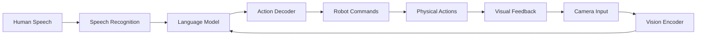
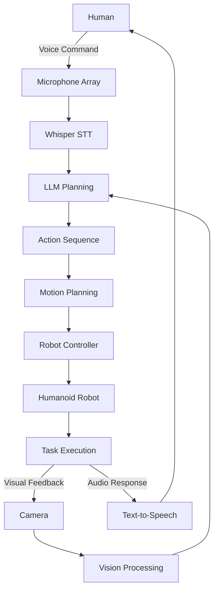

# Module 4: Vision-Language-Action (VLA)

**Focus**: The convergence of LLMs and Robotics

---

## Overview

Welcome to the final module, where we integrate everything you've learned into intelligent, conversational robots. **Vision-Language-Action (VLA)** models represent the cutting edge of robotics—systems that can see, understand natural language, and take physical actions in the world.

This module transforms robots from pre-programmed machines into adaptive assistants that understand human intent and execute complex tasks through natural language commands.

---

## What is VLA?

**Vision-Language-Action** models combine three capabilities:

* **Vision**: Understanding visual scenes (cameras, depth sensors)
* **Language**: Processing natural language commands and queries
* **Action**: Generating robot control sequences

### Example Interaction

**Human**: "Pick up the red cup and place it on the table"

**Robot**:
1. **Vision**: Identifies red cup and table in camera feed
2. **Language**: Parses command into sub-tasks
3. **Action**: Plans grasp, navigation, and placement motions
4. **Execution**: Performs task while monitoring progress

---

## Why VLA Matters

### Traditional Robotics

* Pre-programmed for specific tasks
* Requires expert programming for each scenario
* Cannot adapt to new situations
* Limited human interaction

### VLA Robotics

* Natural language interface (anyone can give commands)
* Generalizes to new tasks
* Learns from demonstrations
* Adapts to environmental changes

---

## Module Contents

### Chapter 1: Humanoid Development and Control

* Bipedal locomotion fundamentals
* Balance and stability control
* Manipulation with humanoid hands
* Full-body motion planning
* Natural human-robot interaction

[Go to Chapter 1 →](/docs/module4/module4-chapter1)

---

### Chapter 2: Conversational Robotics with LLMs

* Speech recognition with OpenAI Whisper
* LLM integration (GPT-4, Claude)
* Natural language to robot actions
* Multi-modal interaction design
* Safety and error handling

[Go to Chapter 2 →](/docs/module4/module4-chapter2)

---

### Chapter 3: Capstone Project - The Autonomous Humanoid

* System integration
* Complete VLA pipeline
* Voice command → Action execution
* Real-world testing
* Performance evaluation

[Go to Chapter 3 →](/docs/module4/module4-chapter3)

---

## Learning Objectives

By the end of this module, you will be able to:

* ✅ Design and control humanoid robot systems
* ✅ Implement speech recognition for robot control
* ✅ Integrate LLMs for natural language understanding
* ✅ Build end-to-end VLA pipelines
* ✅ Deploy conversational robots
* ✅ Evaluate and improve system performance
* ✅ Complete a full autonomous humanoid project

---

## Key Technologies

### Speech Processing

* **OpenAI Whisper**: State-of-the-art speech recognition
* **Festival/Piper**: Text-to-speech for robot responses
* **ReSpeaker**: Far-field microphone arrays

### Language Models

* **GPT-4**: Advanced reasoning and planning
* **Claude**: Long-context understanding
* **Open-source alternatives**: LLaMA, Mistral

### VLA Models

* **RT-1/RT-2**: Google's robotics transformers
* **PaLM-E**: Embodied multimodal language model
* **π₀ (Pi-Zero)**: Physical intelligence VLA

---

## Architecture Overview

---

## Hands-On Projects

This module includes comprehensive projects:

* **Project 1**: Implement bipedal walking controller
* **Project 2**: Build voice-controlled robot arm
* **Project 3**: Create LLM-based task planner
* **Project 4**: Integrate vision, language, and action
* **Capstone**: Autonomous humanoid performing complex tasks

---

## Assessment

* Humanoid control assignment (20%)
* Speech integration project (20%)
* LLM task planning (20%)
* Final capstone project (40%)

---

## Prerequisites

* Completion of Modules 1-3
* Understanding of ROS 2, simulation, and perception
* Python proficiency
* Basic knowledge of transformers and LLMs
* Access to GPU hardware for inference

---

## Hardware & Software

### Required Hardware

* **Simulation**: RTX 4070+ for Isaac Sim
* **Edge Deployment**: Jetson Orin (16GB+)
* **Audio**: USB microphone (ReSpeaker recommended)
* **Vision**: RealSense D435i or equivalent

### Required Software

* ROS 2 Humble
* Isaac Sim 2023.1.1+
* PyTorch 2.0+
* Transformers library
* OpenAI API key (or local LLM)

---

## The Capstone Project

### The Autonomous Humanoid

Your final project: A humanoid robot that:

1. Receives voice commands in natural language
2. Uses vision to understand its environment
3. Plans multi-step actions using LLM
4. Executes tasks with full-body control
5. Provides verbal feedback on progress

**Example Scenario**:

**Human**: "Clean the living room"

**Robot**:
* Understands "clean" means pick up objects
* Visually identifies scattered items
* Plans navigation path
* Picks up each object
* Places in designated area
* Reports: "Living room cleaned"

---

## Industry Applications

### Healthcare

* Patient assistance and mobility support
* Medication delivery
* Monitoring and companionship

### Hospitality

* Reception and concierge services
* Room service delivery
* Guest interaction

### Manufacturing

* Collaborative assembly
* Quality inspection
* Flexible task execution

### Domestic

* Household chores
* Elderly care
* Security and monitoring

---

## Ethical Considerations

### Safety

* Collision avoidance
* Force limits
* Emergency stop mechanisms
* Human detection and avoidance

### Privacy

* Voice data handling
* Camera feed privacy
* Data storage policies
* User consent

### Bias and Fairness

* LLM bias mitigation
* Inclusive design
* Accessibility features
* Testing with diverse users

---

## Timeline

### Week 11: Humanoid Development

* Bipedal locomotion
* Manipulation skills
* Motion planning

### Week 12: Conversational AI

* Speech recognition
* LLM integration
* Multi-modal fusion

### Week 13: Capstone Project

* System integration
* Testing and debugging
* Final presentation

---

## Success Metrics

Your capstone will be evaluated on:

* **Functionality** (40%): Does it work reliably?
* **Natural Interaction** (20%): Is the interface intuitive?
* **Robustness** (20%): Handles errors gracefully?
* **Innovation** (20%): Creative problem-solving?

---

**Ready to build the future of human-robot interaction? Let's begin!** 🤖💬